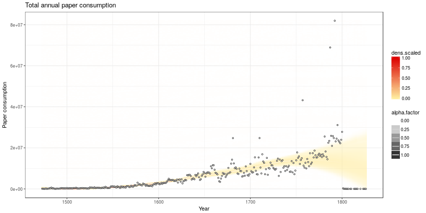
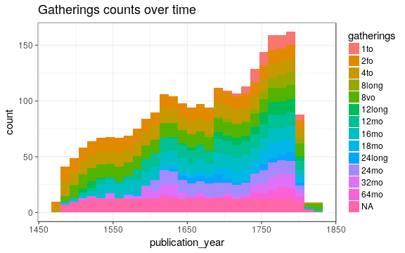
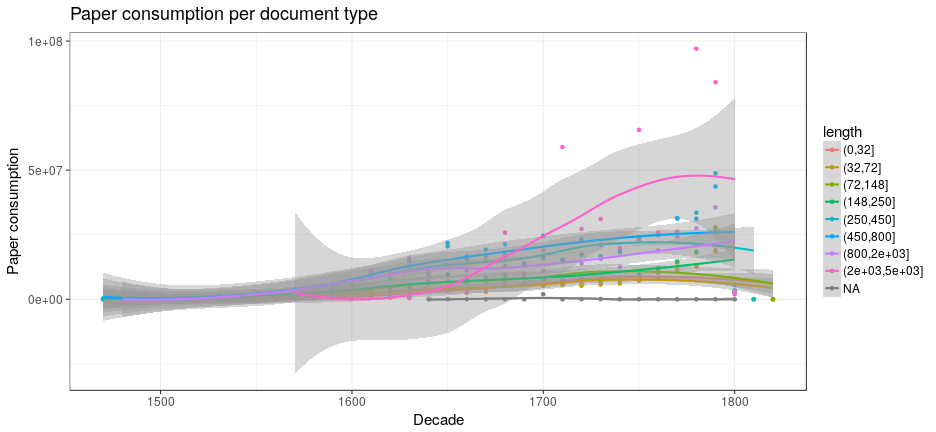
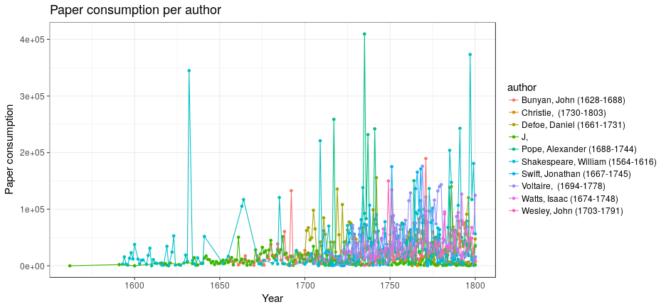
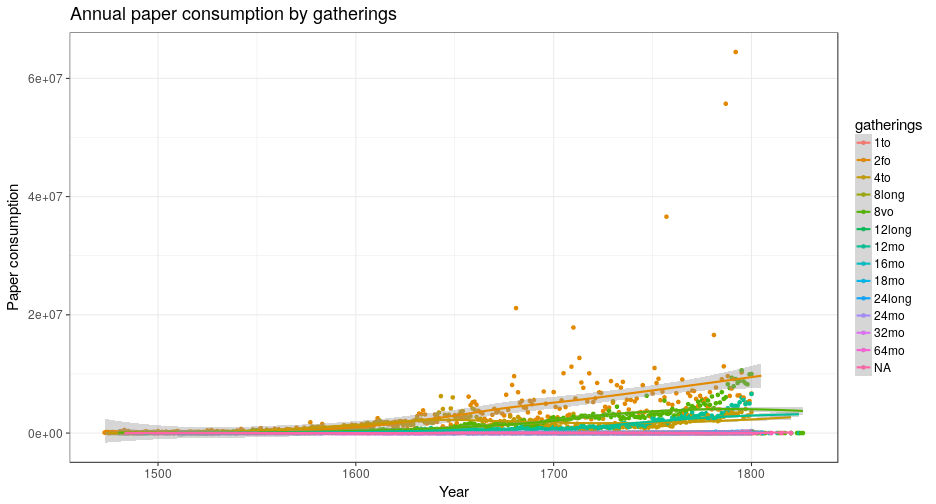

## Page counts

Page count: distribution of document sizes


```
## Error in eval(expr, envir, enclos): unknown column 'dimension.gatherings'
```

```
## Error in eval(expr, envir, enclos): unknown column 'dimension.gatherings'
```

```
## Error in ggplot(dff2, aes(y = dimension.gatherings, x = pages.total)): object 'dff2' not found
```

```
## Error in fortify(data): object 'dff3' not found
```

```
## Error in fortify(data): object 'dff3' not found
```

```
## Error in eval(expr, envir, enclos): object 'items' not found
```

```
## Error in eval(expr, envir, enclos): unknown column 'dimension.gatherings'
```

```
## Error in eval(expr, envir, enclos): unknown column 'dimension.gatherings'
```

```
## Error in ggplot(dff2, aes(y = dimension.gatherings, x = pages.total)): object 'dff2' not found
```

```
## Error in fortify(data): object 'dff3' not found
```

```
## Error in fortify(data): object 'dff3' not found
```


## Documents with missing pages over years 


```
## Error in eval(expr, envir, enclos): unknown column 'dimension.gatherings'
```

```
## Error in `$<-.data.frame`(`*tmp*`, "na", value = logical(0)): replacement has 0 rows, data has 992
```

```
## Error in eval(expr, envir, enclos): object 'publication_decade' not found
```


```
## Error in eval(expr, envir, enclos): unknown column 'dimension.gatherings'
```

```
## Error in df2b$na[df2b$na == 0] <- NA: object 'df2b' not found
```

```
## Error in ggplot(df2b, aes(x = publication_decade, y = dimension.gatherings, : object 'df2b' not found
```

```
## Error in na.omit(df2b$na): object 'df2b' not found
```

```
## Error in eval(expr, envir, enclos): object 'publication_decade' not found
```


## Estimated paper consumption

Note: there are 0 documents that have some dimensions information but sheet area information could not be calculated for some reason. 




```
## Error in eval(expr, envir, enclos): unknown column 'dimension.gatherings'
```

```
## Error in eval(expr, envir, enclos): object 'dimension.gatherings' not found
```

```
## Error in eval(expr, envir, enclos): object 'dimension.gatherings' not found
```


```
## Error in eval(expr, envir, enclos): object 'dimension.gatherings' not found
```

```
## Error in eval(expr, envir, enclos): unknown column 'dimension.gatherings'
```

```
## Error in eval(expr, envir, enclos): object 'dimension.gatherings' not found
```

```
## Error in eval(expr, envir, enclos): object 'dimension.gatherings' not found
```



```
## Error in eval(expr, envir, enclos): object 'dimension.gatherings' not found
```

p <- ggplot(df2, aes(y = n, x = publication_year, group = dimension.gatherings, color = dimension.gatherings))
p <- p + geom_point()
#p <- p + geom_line()
#p <- p + scale_y_log10()
p <- p + geom_smooth(method = "loess", size = 1)
p <- p + ggtitle("Annual title count by gatherings")
p <- p + xlab("Year")
p <- p + ylab("Documents (n)")
print(p)
```


## Pamphlets vs. Books


```
## Error in seq.default(h[1], h[2], length.out = n): 'to' cannot be NA, NaN or infinite
```


```
## Error in seq.default(h[1], h[2], length.out = n): 'to' cannot be NA, NaN or infinite
```


```
## Error in eval(expr, envir, enclos): object 'pages.total' not found
```

```
## Error in eval(expr, envir, enclos): unknown column 'length'
```

```
## Error in eval(expr, envir, enclos): object 'publication_decade' not found
```



```
## Error in eval(expr, envir, enclos): object 'publication_decade' not found
```


## Top authors




## Nature of the documents over time

Estimated paper consumption by document size


```
## Error in eval(expr, envir, enclos): unknown column 'dimension.gatherings'
```

```
## Error in eval(expr, envir, enclos): object 'dimension.gatherings' not found
```

```
## Error in eval(expr, envir, enclos): object 'dimension.gatherings' not found
```




Gatherings height: does it change over time (1600's)? How increased printing activity is related to book size trends? Instead, we could use area (height x width), or simply calculate median over time but let's discuss this later.


```
## Error in eval(expr, envir, enclos): object 'dimension.gatherings.original' not found
```


Page counts: does it change over time (1600's)? Also suggested we could calculate some kind of factor for each time period based on this ? In principle, we could calculate this separately for any given publication place as well but leẗ́s discuss this later. Would help to specify some specific places of interest.


```
## Error in eval(expr, envir, enclos): object 'dimension.gatherings.original' not found
```


Same for documents that have a sufficient number of pages:


```
## Error in eval(expr, envir, enclos): object 'pages.total' not found
```
