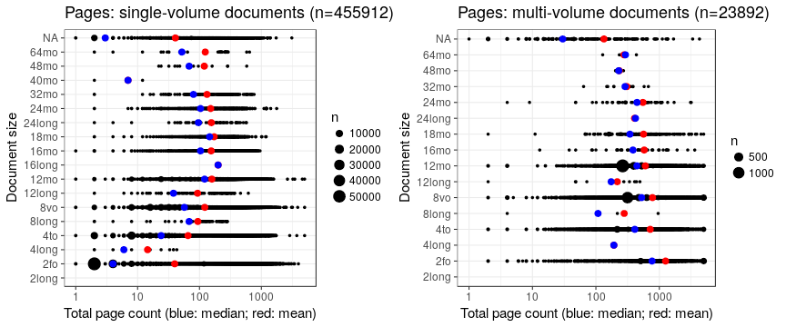
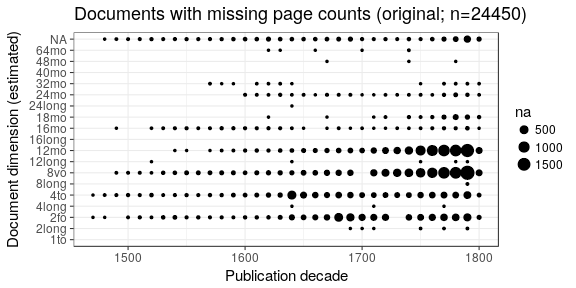
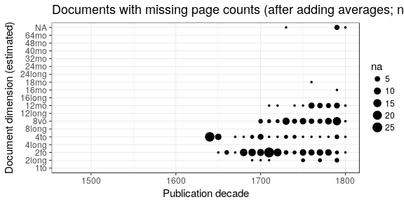
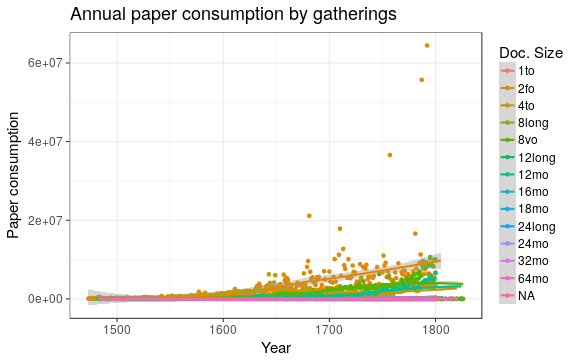
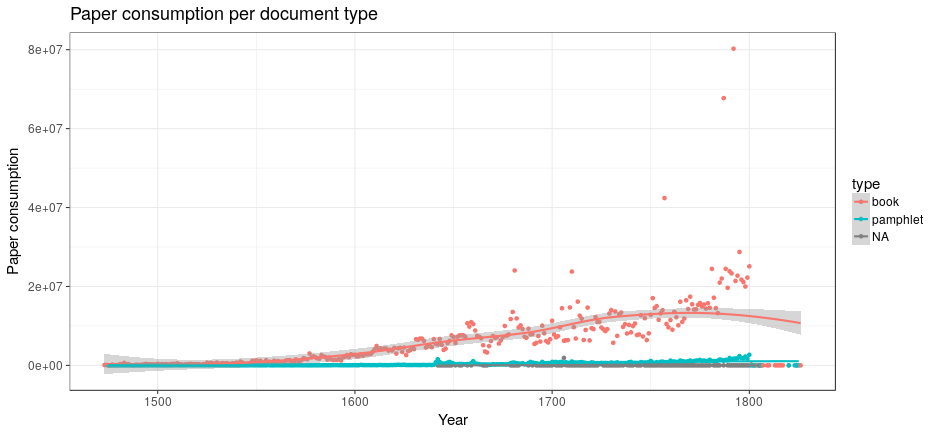
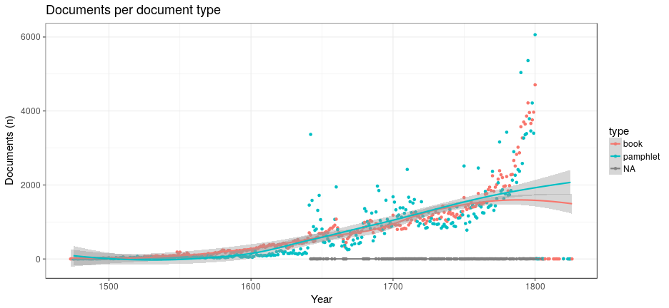
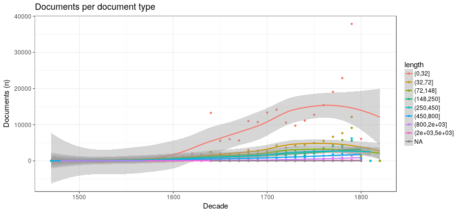
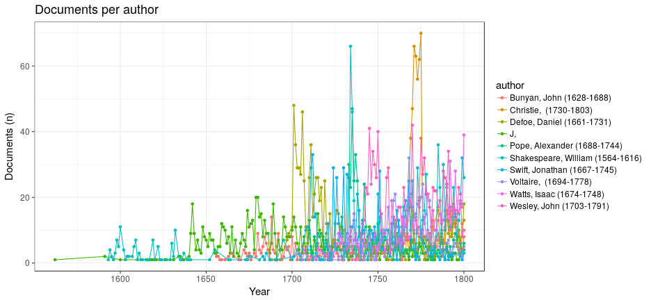

## Page counts

Page count: distribution of document sizes

 

## Documents with missing pages over years 

  

## Estimated paper consumption

Note: there are 2182 documents that have some dimensions information but sheet area information could not be calculated for some reason. 

  

   

 

## Pamphlets vs. Books

  

  

## Top authors

  

## Nature of the documents over time

Estimated paper consumption by document size

 

