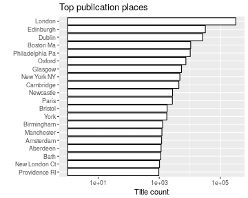
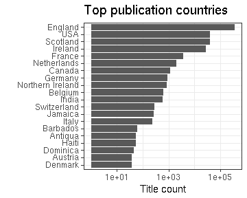

### Publication places

 * 1092 [publication places](output.tables/publication_place_accepted.csv); available for 478782 documents (99%). 
 * 55 [publication countries](output.tables/country_accepted.csv); available for 478178 documents (99%).
 * 91.4% of the documents could be matched to geographic coordinates (based on the [Geonames](http://download.geonames.org/export/dump/) database). See the [list of places missing geocoordinate information](output.tables/absentgeocoordinates.csv). Altogether ``8.58``% of the documents have missing geocoordinates.
 * [Places with unknown publication country](output.tables/publication_place_missingcountry.csv) (can be added to [country mappings](https://github.com/rOpenGov/bibliographica/blob/master/inst/extdata/reg2country.csv))
 * [Ambiguous publication places](output.tables/publication_place_ambiguous.csv); some of these can be possibly resolved by checking that the the [synonyme list](https://github.com/rOpenGov/bibliographica/blob/master/inst/extdata/PublicationPlaceSynonymes.csv) does not contain multiple versions of the final name (case sensitive). 
 * [Potentially ambiguous region-country mappings](output.tables/publication_country_ambiguous.csv) (these may occur in the data in various synonymes and the country is not always clear when multiple countries have a similar place name; the default country is listed first). NOTE: possible improvements should not be done in this output summary but instead in the [countruy mapping file](https://github.com/rOpenGov/bibliographica/blob/master/inst/extdata/reg2country.csv).
 * [Conversions from the original to the accepted place names](output.tables/publication_place_conversion_nontrivial.csv)
 * [Unknown place names](output.tables/publication_place_todo.csv) These terms do not map to any known place on the [synonyme list](https://github.com/rOpenGov/bibliographica/blob/master/inst/extdata/PublicationPlaceSynonymes.csv); either because they require further cleaning or have not yet been encountered in the analyses. Terms that are clearly not place names can be added to [stopwords](inst/extdata/stopwords_for_place.csv); borderline cases that are not accepted as place names can be added as NA on the [synonyme list](https://github.com/rOpenGov/bibliographica/blob/master/inst/extdata/PublicationPlaceSynonymes.csv).
 * [Discarded place names](output.tables/publication_place_discarded.csv) These terms are potential place names but with a closer check have been explicitly rejected on the [synonyme list](https://github.com/rOpenGov/bibliographica/blob/master/inst/extdata/PublicationPlaceSynonymes.csv)
 * [Unit tests for place names](https://github.com/rOpenGov/bibliographica/blob/master/inst/extdata/tests_place.csv) are automatically checked during package build

Top-20 publication places are shown together with the number of documents.

### Top publication countries	

|Country     | Documents (n)| Fraction (%)|
|:-----------|-------------:|------------:|
|England     |        358383|         74.4|
|USA         |         41017|          8.5|
|Scotland    |         40239|          8.4|
|Ireland     |         27564|          5.7|
|France      |          3488|          0.7|
|Netherlands |          2038|          0.4|

