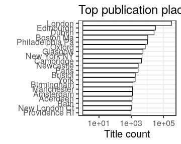

### Publication places

[Publication countries](output.tables/country_accepted.csv)

[Publication country not identified](output.tables/country_discarded.csv)

[Discarded publication places](output.tables/publication_place_discarded.csv)

[Publication place conversions](output.tables/publication_place_conversion_nontrivial.csv)

[Places missing geocoordinate information](output.tables/absentgeocoordinates.csv)

Top-20 publication places are shown together with the number of documents. This info is available for 473022 documents (98%). There are 476 unique publication places. Overall 86.1% of the places could be matched to geographic coordinates (from the [Geonames](http://download.geonames.org/export/dump/) database).

|name        |      n|   fraction|
|:-----------|------:|----------:|
|England     | 365151| 75.7931640|
|Scotland    |  39393|  8.1766724|
|Ireland     |  28493|  5.9141961|
|USA         |  19813|  4.1125177|
|France      |   3073|  0.6378523|
|Netherlands |   1943|  0.4033020|
