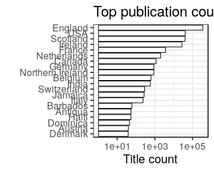

### Publication places

[Publication countries](output.tables/country_accepted.csv)

[Publication country not identified](output.tables/country_discarded.csv)

[Discarded publication places](output.tables/publication_place_discarded.csv)

[Publication place conversions](output.tables/publication_place_conversion_nontrivial.csv)

[Places missing geocoordinate information](output.tables/absentgeocoordinates.csv)

Top-20 publication places are shown together with the number of documents. This info is available for 474461 documents (98%). There are 477 unique publication places. Overall 86% of the places could be matched to geographic coordinates (from the [Geonames](http://download.geonames.org/export/dump/) database).

|name        |      n|   fraction|
|:-----------|------:|----------:|
|England     | 366006| 75.7237082|
|Scotland    |  39471|  8.1662336|
|Ireland     |  28618|  5.9208349|
|USA         |  19961|  4.1297709|
|France      |   3080|  0.6372273|
|Netherlands |   1954|  0.4042669|
