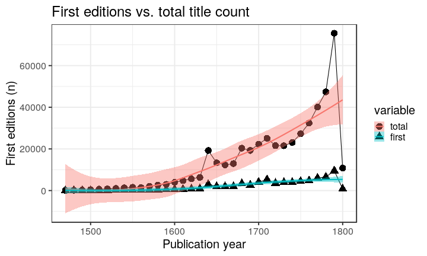

### Publication year

[Publication year conversions](output.tables/publication_year_conversion.csv)

[Publication year discarded](output.tables/publication_year_discarded.csv)

Publication year is available for 481210 documents (100%). The publication years span 1462-1826.


### Publication frequency

Publication frequency is available for 3263 documents (1%). The links are invalid if the lists are empty.

[Publication frequency accepted](output.tables/publication_frequency_discarded.csv)

[Publication frequency conversions](output.tables/publication_frequency_conversion.csv)

[Publication frequency discarded](output.tables/publication_frequency_discarded.csv)


### Publication interval

Publication interval is available for 3694 documents (1%). 

[Publication interval accepted](output.tables/publication_interval_discarded.csv)

[Publication interval conversions](output.tables/publication_interval_conversion.csv)

[Publication interval discarded](output.tables/publication_interval_discarded.csv)


### Editions

Automated detection of potential first editions (first_edition field)
identifies unique author-title pairs, and proposes the first
occcurrence (earliest publication_year) as the first edition. If there
are multiple instances from the same earliest year, they are all
marked as potential first editions. Later need to check if this
information is readily available in MARC.

In this data we have 369718
unique documents with an identical title and author. Out of these,
44442
have multiple occurrences, sometimes with different publication years.
Where multiple publication years are seen, the earliest occurrence is
suggested as the first edition.

This figure shows the number of first editions per decade.


```
## Error in paste("First editions count (", catalogue, ")", sep = ""): object 'catalogue' not found
```




