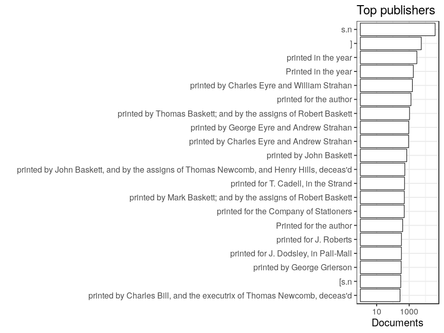
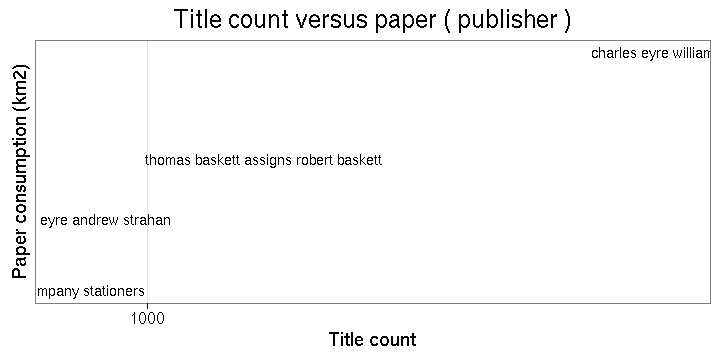

### Publishers

 * 187447 [unique publishers](output.tables/publisher_accepted.csv)

 * 374461 documents have unambiguous publisher information (78%). This includes documents identified as self-published; the author name is used as the publisher in those cases (if known).

 * 0 documents are identified as self-published (0%). 

 * [Discarded publisher entries](output.tables/publisher_discarded.csv)

 * [Conversions from original to final names](output.tables/publisher_conversion_nontrivial.csv) (only non-trivial conversions shown)

The 20 most common publishers are shown with the number of documents. 

### Publication timeline for top publishers

Title count

Title count versus paper consumption (top publishers):

|publisher                                                       | titles|    paper|
|:---------------------------------------------------------------|------:|--------:|
|]                                                               |   5504| 12516668|
|printed by Charles Eyre and Andrew Strahan                      |    918|  8500292|
|printed by Charles Eyre and William Strahan                     |   1566| 11313556|
|printed by George Eyre and Andrew Strahan                       |    940|  4363924|
|printed by John Baskett                                         |    707|  3250639|
|printed by Thomas Baskett; and by the assigns of Robert Baskett |   1047|  6208541|
|printed for the author                                          |   1288|  4780571|
|printed in the year                                             |   2952|  5474930|
|Printed in the year                                             |   1788|  4533479|
|s.n                                                             |  39047| 34384522|

### Corporates

Summaries of the corporate field.

 * 0 [unique corporates](output.tables/corporate_accepted.csv)

 * 0 documents have unambiguous corporate information (NaN%). 

 * [Discarded corporate entries](output.tables/corporate_discarded.csv)

 * [Conversions from original to final names](output.tables/corporate_conversion_nontrivial.csv) (only non-trivial conversions shown)

The 20 most common corporates are shown with the number of documents. 

