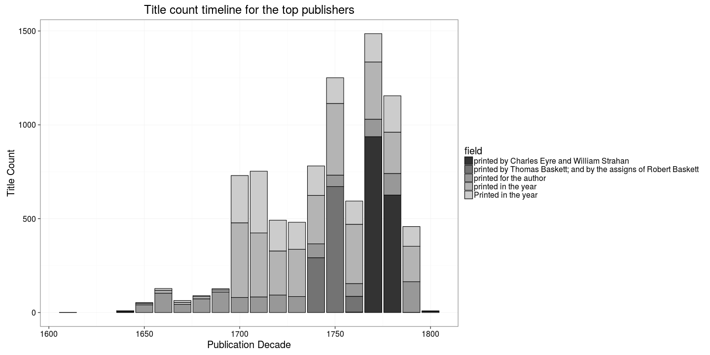

### Publishers

[Publishers accepted](output.tables/publisher_accepted.csv)

[Publishers discarded](output.tables/publisher_discarded.csv)

The 20 most common publishers are shown with the number of documents. Publisher information is available for 364235 documents (76%). There are 170469 unique publisher names (some may be synonymes, though).

### Publication timeline for top publishers

Title count

Title count versus paper consumption (top publishers):

|publisher                             | titles|    paper|
|:-------------------------------------|------:|--------:|
|charles eyre andrew strahan           |    932|     -Inf|
|charles eyre william strahan          |   1585| 6.884003|
|company stationers                    |    946| 1.625135|
|george eyre andrew strahan            |    943| 2.482916|
|thomas baskett assigns robert baskett |   1106| 3.592955|
