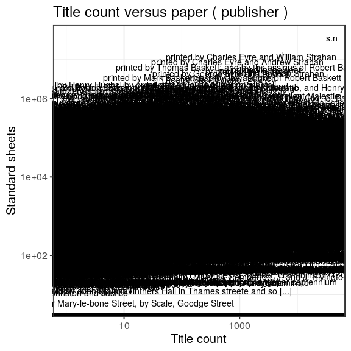

### Publishers

 * 218473 [unique publishers](output.tables/publisher_accepted.csv)

 * 369567 documents have unambiguous publisher information (77%). 

 * [Discarded publisher entries](output.tables/publisher_discarded.csv)

 * [Conversions from original to final names](output.tables/publisher_conversion_nontrivial.csv) (only non-trivial conversions shown)


The 20 most common publishers are shown with the number of documents. 


### Publication timeline for top publishers

Title count


Title count versus paper consumption (top publishers):


```
## Error in seq.default(min, max, by = by): 'from' cannot be NA, NaN or infinite
```



|publisher                                                                                | titles| paper|
|:----------------------------------------------------------------------------------------|------:|-----:|
|printed by Charles Eyre and Andrew Strahan                                               |    918|     0|
|printed by Charles Eyre and William Strahan                                              |   1566|     0|
|printed by George Eyre and Andrew Strahan                                                |    940|     0|
|printed by John Baskett                                                                  |    707|     0|
|printed by John Baskett, and by the assigns of Thomas Newcomb, and Henry Hills, deceas'd |    538|     0|
|printed by Thomas Baskett; and by the assigns of Robert Baskett                          |   1047|     0|
|printed for T. Cadell, in the Strand                                                     |    517|     0|
|printed for the author                                                                   |   1286|     0|
|printed in the year                                                                      |   2950|     0|
|Printed in the year                                                                      |   1778|     0|


