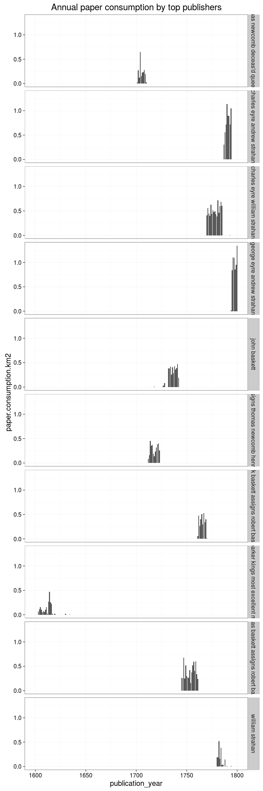

### Publishers

[Publishers accepted](output.tables/publisher_accepted.csv)

[Publishers discarded](output.tables/publisher_discarded.csv)


The 20 most common publishers are shown with the number of documents. Publisher information is available for 365409 documents (76%). There are 161986 unique publisher names (some may be synonymes, though).


### Publication timeline for top publishers

Title count


```
## Warning: Removed 1 rows containing missing values (position_stack).
```


Paper consumption




Title count versus paper consumption (top publishers):


|publisher                             | titles|    paper|
|:-------------------------------------|------:|--------:|
|author                                |   1995| 4.158264|
|charles eyre william strahan          |   1585| 8.269442|
|company stationers                    |    953| 1.256797|
|george eyre andrew strahan            |    943| 6.206504|
|thomas baskett assigns robert baskett |   1106| 6.436823|
