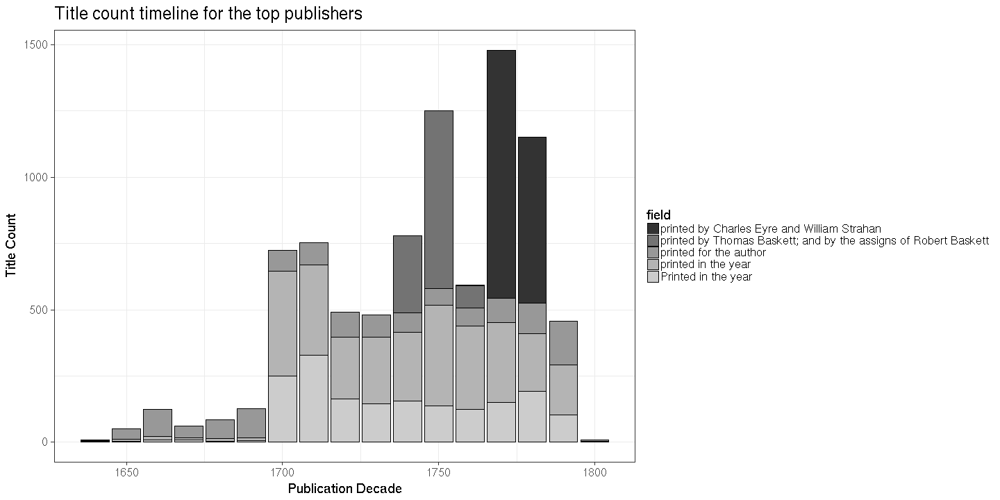

### Publishers

[Publishers accepted](output.tables/publisher_accepted.csv)

[Publishers discarded](output.tables/publisher_discarded.csv)


The 20 most common publishers are shown with the number of documents. Publisher information is available for 36010 documents (79%). There are 21705 unique publisher names (some may be synonymes, though).


```
## Error in (function (..., row.names = NULL, check.rows = FALSE, check.names = TRUE, : arguments imply differing number of rows: 20, 0
```


### Publication timeline for top publishers

Title count




Title count versus paper consumption (top publishers):


|publisher                                                                                                                    | titles|     paper|
|:----------------------------------------------------------------------------------------------------------------------------|------:|---------:|
|assigns his majesty's henry hills deceased                                                                                   |    187| 0.2050622|
|author c moran great piazza covent garden                                                                                    |    568| 0.6722392|
|morphew near stationers-hall                                                                                                 |    210| 0.4832368|
|sumptibus theodori veridici                                                                                                  |    263| 0.3181479|
|w rogers abel roper fleet-street harris nicholson little-britain newborough st paul's church-yard cockerill pater-noster-row |    151| 0.0689600|
