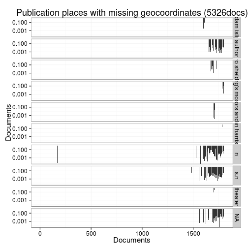

# Summary of the preprocessed ESTC data


## Annotated documents

Fraction of documents with entries for each annotation field (final preprocessed data).

 


## Topics


```
## [1] "Complete subject topic counts in file: output.tables/subjecttopics.tab"
```

Top-50 topics and number of documents for each. In total, there are 7058 unique topics and 21938 documents assigned to one or more topics (44).

 


## Authors

Top-50 uniquely identified authors and number of documents for each (duplicate docs not checked yet). In total, there are 5413 unique authors and 16954 documents with unambiguous author information (34%).

 


### Gender

Gender distribution for authors over time. Note that the name-gender mappings change over time. This has not been taken into account yet.


```
## 
## female   male 
##  0.026  0.974
```

 

### Ambiguous authors

Authors with ambiguous living year information - can we spot here
cases where these are clearly known identical or distinct authors?
Should also add living year information from supporting sources later.


|author.name | author.birth| author.death|
|:-----------|------------:|------------:|


### Life span of uniquely identified top authors

Ordered by productivity (number of documents))


```
## Error in seq.default(from = best$lmin, to = best$lmax, by = best$lstep): 'from' must be of length 1
```

### Publication timeline for top-10 authors

Title count

 


Paper consumption


```
## Error in `[.data.frame`(base, names(rows)): undefined columns selected
```


### Publication timeline for top-10 publishers

Title count


```
## Warning: Removed 1 rows containing missing values (position_stack).
```

```
## Warning: Removed 1 rows containing missing values (position_stack).
```

```
## Warning: Removed 1 rows containing missing values (position_stack).
```

```
## Warning: Removed 1 rows containing missing values (position_stack).
```

```
## Warning: Removed 1 rows containing missing values (position_stack).
```

```
## Warning: Removed 1 rows containing missing values (position_stack).
```

 


Paper consumption


```
## Warning: Removed 1 rows containing missing values (position_stack).
```

```
## Warning: Removed 1 rows containing missing values (position_stack).
```

```
## Warning: Removed 1 rows containing missing values (position_stack).
```

```
## Warning: position_stack requires constant width: output may be incorrect
```

 

## Document Subject

### Subject historical time spans

Retrieved time span for the document subjects is available for 146 documents. In some cases the time span has a gap in the middle, we will need to check this again as there were changes in raw data processing. We can later add these and visualize also the gaps if needed but this preprocessing is now done to simplify the analysis. Documents with no full time span have been removed. Ordered by time span averages.

 


### Subject geographical places


Top-50 geographical places that the documents are associated with. Geography information is available for 50237 documents (100%). There are 1985 unique geographical places.

 


```
## [1] "Complete counts in file: output.tables/geoplaces.csv"
```


## Publication 

### Publication places

Top-50 publication places are shown together with the number of documents. This info is available for 49026 documents (98%). There are 367 unique publication places. Overall 93.9% of the places could be matched to geographic coordinates (from the [Geonames](http://download.geonames.org/export/dump/) database).

 


```
## [1] "Complete counts in file: output.tables/publicationplaces.csv"
```

```
## [1] "Complete counts in file: output.tables/publicationcountries.csv"
```


|            |     n|
|:-----------|-----:|
|England     | 38273|
|USA         |  3488|
|Ireland     |  3486|
|Scotland    |  2848|
|France      |   309|
|Netherlands |   307|
|Germany     |    57|
|Canada      |    52|
|Switzerland |    45|
|Belgium     |    42|
|India       |    39|
|Jamaica     |    22|
|Italy       |     9|
|Barbados    |     9|
|Northern    |     8|
|Bahamas     |     6|
|Dominica    |     4|
|Martinique  |     3|
|Denmark     |     3|
|Sweden      |     2|
|Spain       |     2|
|Austria     |     2|
|Walkes      |     1|
|unknown     |     1|
|Poland      |     1|
|Jersey      |     1|
|Haiti       |     1|
|Guernesey   |     1|
|Grenada     |     1|
|Europe      |     1|

 

### Publishers


The 50 most common publishers are shown with the number of documents. Publisher information is available for 2781 documents (6%). There are 1171 unique publisher names (some may be synonymes, though).


 


```
## [1] "Complete counts in file: output.tables/publishers.csv"
```


### Publication year

Publication year is available for 45329 documents (90%). The publication years span -1866-1799

 


### Titles

Top-50 titles are shown together with the number of documents. This info is available for 50237 documents (100%). There are 41270 unique titles.

 


```
## [1] "Complete counts in file: output.tables/titles.csv"
```

## Language

The 21 unique languages are shown together with the number of documents. This info is available for 50237 documents (100%). 

 


```
## [1] "Complete counts in file: output.tables/languages.csv"
```


## Document size comparisons

Document size (area) info in cm2 is available for 48055 documents (96%). Estimates of document size (area) info in gatherings system are available for 50237 documents (100%). 

 

Compare gatherings and cm2 sizes as a quality check. This includes all data; the area has been estimated from the gatherings when dimension information was not available.


```
## Error in eval(expr, envir, enclos): could not find function "melt"
```

```
## Error in names(dfm) <- c("gatherings", "cm2", "documents"): object 'dfm' not found
```

```
## Error in factor(dfm$gatherings, levels = levels(df$document.dimension.gatherings.original)): object 'dfm' not found
```

```
## Error in ggplot(dfm, aes(x = gatherings, y = cm2)): object 'dfm' not found
```

```
## Error in eval(expr, envir, enclos): object 'documents' not found
```

Compare gatherings and page counts. Page count information is estimated for -2828 documents and updated (changed) for 1082 documents. 

 

Compare original gatherings and original heights where both are available. The point size indicates the number of documents with the corresponding combination. The red dots indicate the estimated height that is used when only gathering information is available. It seems that in most documents, the given height is smaller than the correponding estimate.

 

## Average page counts 

Multi-volume documents average page counts are given per volume.


|doc.dimension | mean.pages.singlevol| median.pages.singlevol| n.singlevol| mean.pages.multivol| median.pages.multivol| n.multivol| mean.pages.issue| median.pages.issue| n.issue|
|:-------------|--------------------:|----------------------:|-----------:|-------------------:|---------------------:|----------:|----------------:|------------------:|-------:|
|1to           |             2.351951|                      2|        4231|                  NA|                    NA|         NA|         9.815789|                  8|      38|
|bs            |             2.000000|                      2|           2|                  NA|                    NA|         NA|               NA|                 NA|      NA|
|2long         |             3.388889|                      2|          23|                  NA|                    NA|         NA|        23.000000|                 23|       1|
|2fo           |            55.109069|                      2|       11579|            722.5041|              716.0000|         41|        16.848329|                 12|    1945|
|2small        |             2.000000|                      2|           4|                  NA|                    NA|         NA|               NA|                 NA|      NA|
|4long         |             2.000000|                      2|          10|                  NA|                    NA|         NA|               NA|                 NA|      NA|
|4to           |            41.646991|                     12|       16048|            475.1733|              474.0000|         72|        15.871095|                  8|   12195|
|8vo           |           138.584409|                     70|       10315|            406.3343|              413.3333|         66|        28.399896|                 28|    3846|
|12long        |            44.923077|                     24|          13|             24.0000|               24.0000|          1|        30.000000|                 24|       4|
|12mo          |           185.558482|                    168|        2590|            260.5657|              211.0000|         33|        26.388461|                 24|     520|
|16mo          |           163.468354|                    116|          79|                  NA|                    NA|         NA|        31.666667|                 28|      12|
|18mo          |           142.971429|                    148|          35|            172.0000|              172.0000|          1|        41.000000|                 41|       2|
|24long        |           244.000000|                    244|           1|                  NA|                    NA|         NA|               NA|                 NA|      NA|
|24mo          |           144.441177|                    146|          34|                  NA|                    NA|         NA|        23.272727|                 24|      11|
|32mo          |           179.333333|                    193|           6|                  NA|                    NA|         NA|               NA|                 NA|      NA|
|40to          |           120.000000|                    120|           1|                  NA|                    NA|         NA|               NA|                 NA|      NA|
|48mo          |           128.000000|                    128|           1|                  NA|                    NA|         NA|               NA|                 NA|      NA|
|64mo          |           197.000000|                    197|           2|                  NA|                    NA|         NA|               NA|                 NA|      NA|
|NA            |            15.150655|                      2|        2326|                  NA|                    NA|         NA|        18.829670|                 15|     364|


```
## Error in ggplot(melt(mean.pagecounts[, c("median.pages.multivol", "median.pages.singlevol", : could not find function "melt"
```

```
## Error in ggplot(melt(mean.pagecounts[, c("mean.pages.multivol", "mean.pages.singlevol", : could not find function "melt"
```

 


## Average document dimensions 

 


|document.dimension.gatherings.original | mean.height| median.height| mean.width| median.width|   n|
|:--------------------------------------|-----------:|-------------:|----------:|------------:|---:|
|2fo                                    |    38.30594|      38.30594|   21.88462|     21.88462| 438|
|4to                                    |    21.53846|      21.53846|   20.50000|     20.50000| 325|
|8vo                                    |    20.74457|      20.74457|        NaN|          NaN| 184|
|12mo                                   |    14.78571|      14.78571|   12.00000|     12.00000|  14|
|NA                                     |    31.73529|      31.73529|   22.37953|     22.37953| 803|

<!--
### Testing rCharts example - perhaps only in HTML with knit2html
<iframe srcdoc=' &lt;!doctype HTML&gt;
&lt;meta charset = &#039;utf-8&#039;&gt;
&lt;html&gt;
  &lt;head&gt;
    
    &lt;link rel=&#039;stylesheet&#039; href=&#039;//cdnjs.cloudflare.com/ajax/libs/nvd3/1.1.15-beta/nv.d3.min.css&#039;&gt;
    
    
    
    &lt;script src=&#039;//ajax.googleapis.com/ajax/libs/jquery/1.8.2/jquery.min.js&#039; type=&#039;text/javascript&#039;&gt;&lt;/script&gt;
    
    &lt;script src=&#039;//d3js.org/d3.v3.min.js&#039; type=&#039;text/javascript&#039;&gt;&lt;/script&gt;
    
    &lt;script src=&#039;//cdnjs.cloudflare.com/ajax/libs/nvd3/1.1.15-beta/nv.d3.min.js&#039; type=&#039;text/javascript&#039;&gt;&lt;/script&gt;
    
    &lt;script src=&#039;//nvd3.org/assets/lib/fisheye.js&#039; type=&#039;text/javascript&#039;&gt;&lt;/script&gt;
    
    
    &lt;style&gt;
    .rChart {
      display: block;
      margin-left: auto; 
      margin-right: auto;
      width: 800px;
      height: 400px;
    }  
    &lt;/style&gt;
    
  &lt;/head&gt;
  &lt;body &gt;
    
    &lt;div id = &#039;chart13081f9f677b&#039; class = &#039;rChart nvd3&#039;&gt;&lt;/div&gt;    
    &lt;script type=&#039;text/javascript&#039;&gt;
 $(document).ready(function(){
      drawchart13081f9f677b()
    });
    function drawchart13081f9f677b(){  
      var opts = {
 &quot;dom&quot;: &quot;chart13081f9f677b&quot;,
&quot;width&quot;:    800,
&quot;height&quot;:    400,
&quot;x&quot;: &quot;Hair&quot;,
&quot;y&quot;: &quot;Freq&quot;,
&quot;group&quot;: &quot;Eye&quot;,
&quot;type&quot;: &quot;multiBarChart&quot;,
&quot;id&quot;: &quot;chart13081f9f677b&quot; 
},
        data = [
 {
 &quot;Hair&quot;: &quot;Black&quot;,
&quot;Eye&quot;: &quot;Brown&quot;,
&quot;Sex&quot;: &quot;Male&quot;,
&quot;Freq&quot;:             32 
},
{
 &quot;Hair&quot;: &quot;Brown&quot;,
&quot;Eye&quot;: &quot;Brown&quot;,
&quot;Sex&quot;: &quot;Male&quot;,
&quot;Freq&quot;:             53 
},
{
 &quot;Hair&quot;: &quot;Red&quot;,
&quot;Eye&quot;: &quot;Brown&quot;,
&quot;Sex&quot;: &quot;Male&quot;,
&quot;Freq&quot;:             10 
},
{
 &quot;Hair&quot;: &quot;Blond&quot;,
&quot;Eye&quot;: &quot;Brown&quot;,
&quot;Sex&quot;: &quot;Male&quot;,
&quot;Freq&quot;:              3 
},
{
 &quot;Hair&quot;: &quot;Black&quot;,
&quot;Eye&quot;: &quot;Blue&quot;,
&quot;Sex&quot;: &quot;Male&quot;,
&quot;Freq&quot;:             11 
},
{
 &quot;Hair&quot;: &quot;Brown&quot;,
&quot;Eye&quot;: &quot;Blue&quot;,
&quot;Sex&quot;: &quot;Male&quot;,
&quot;Freq&quot;:             50 
},
{
 &quot;Hair&quot;: &quot;Red&quot;,
&quot;Eye&quot;: &quot;Blue&quot;,
&quot;Sex&quot;: &quot;Male&quot;,
&quot;Freq&quot;:             10 
},
{
 &quot;Hair&quot;: &quot;Blond&quot;,
&quot;Eye&quot;: &quot;Blue&quot;,
&quot;Sex&quot;: &quot;Male&quot;,
&quot;Freq&quot;:             30 
},
{
 &quot;Hair&quot;: &quot;Black&quot;,
&quot;Eye&quot;: &quot;Hazel&quot;,
&quot;Sex&quot;: &quot;Male&quot;,
&quot;Freq&quot;:             10 
},
{
 &quot;Hair&quot;: &quot;Brown&quot;,
&quot;Eye&quot;: &quot;Hazel&quot;,
&quot;Sex&quot;: &quot;Male&quot;,
&quot;Freq&quot;:             25 
},
{
 &quot;Hair&quot;: &quot;Red&quot;,
&quot;Eye&quot;: &quot;Hazel&quot;,
&quot;Sex&quot;: &quot;Male&quot;,
&quot;Freq&quot;:              7 
},
{
 &quot;Hair&quot;: &quot;Blond&quot;,
&quot;Eye&quot;: &quot;Hazel&quot;,
&quot;Sex&quot;: &quot;Male&quot;,
&quot;Freq&quot;:              5 
},
{
 &quot;Hair&quot;: &quot;Black&quot;,
&quot;Eye&quot;: &quot;Green&quot;,
&quot;Sex&quot;: &quot;Male&quot;,
&quot;Freq&quot;:              3 
},
{
 &quot;Hair&quot;: &quot;Brown&quot;,
&quot;Eye&quot;: &quot;Green&quot;,
&quot;Sex&quot;: &quot;Male&quot;,
&quot;Freq&quot;:             15 
},
{
 &quot;Hair&quot;: &quot;Red&quot;,
&quot;Eye&quot;: &quot;Green&quot;,
&quot;Sex&quot;: &quot;Male&quot;,
&quot;Freq&quot;:              7 
},
{
 &quot;Hair&quot;: &quot;Blond&quot;,
&quot;Eye&quot;: &quot;Green&quot;,
&quot;Sex&quot;: &quot;Male&quot;,
&quot;Freq&quot;:              8 
} 
]
  
      if(!(opts.type===&quot;pieChart&quot; || opts.type===&quot;sparklinePlus&quot; || opts.type===&quot;bulletChart&quot;)) {
        var data = d3.nest()
          .key(function(d){
            //return opts.group === undefined ? &#039;main&#039; : d[opts.group]
            //instead of main would think a better default is opts.x
            return opts.group === undefined ? opts.y : d[opts.group];
          })
          .entries(data);
      }
      
      if (opts.disabled != undefined){
        data.map(function(d, i){
          d.disabled = opts.disabled[i]
        })
      }
      
      nv.addGraph(function() {
        var chart = nv.models[opts.type]()
          .width(opts.width)
          .height(opts.height)
          
        if (opts.type != &quot;bulletChart&quot;){
          chart
            .x(function(d) { return d[opts.x] })
            .y(function(d) { return d[opts.y] })
        }
          
         
        
          
        

        
        
        
      
       d3.select(&quot;#&quot; + opts.id)
        .append(&#039;svg&#039;)
        .datum(data)
        .transition().duration(500)
        .call(chart);

       nv.utils.windowResize(chart.update);
       return chart;
      });
    };
&lt;/script&gt;
    
    &lt;script&gt;&lt;/script&gt;    
  &lt;/body&gt;
&lt;/html&gt; ' scrolling='no' frameBorder='0' seamless class='rChart  nvd3  ' id='iframe-chart13081f9f677b'> </iframe>
 <style>iframe.rChart{ width: 100%; height: 400px;}</style>
-->

