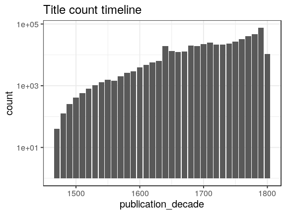
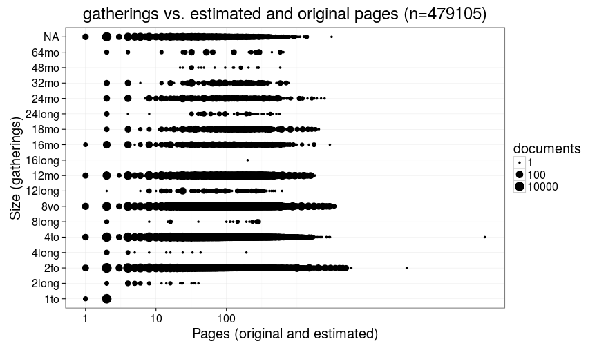
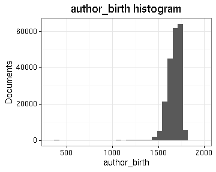
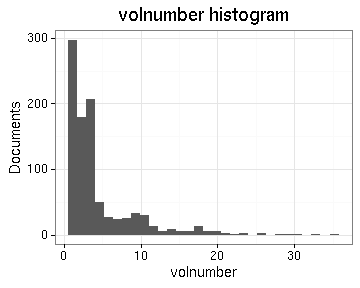

# Summary of the preprocessed ESTC data

## Field conversions

This document links to files that summarize the conversions from raw data to the final preprocessed version (accepted, discarded, conversions). Only some of the key tables are explicitly linked below. The complete list of those summary tables is available [here](output.tables/).


```
## Error in `$<-.data.frame`(`*tmp*`, "gatherings.original", value = structure(integer(0), .Label = c("1to", : replacement has 0 rows, data has 50283
```


## Annotated documents

Fraction of documents with entries for each annotation field (final preprocessed data).

 

Number of documents with NA entries and number of unique entries for each field:


|                      | available| unique|
|:---------------------|---------:|------:|
|parts                 |         0|      1|
|volnumber             |       156|     15|
|author_birth          |     15331|    348|
|author_death          |     15953|    370|
|author_gender         |     16899|      3|
|author_name           |     18231|   6097|
|topic                 |     21970|   7065|
|latitude              |     44951|    133|
|longitude             |     44951|    133|
|paper.consumption.km2 |     48061|   2822|
|width                 |     48096|     52|
|height                |     48096|     47|
|area                  |     48096|    299|
|pages_per_part        |     48110|    888|
|publication_country   |     48293|     32|
|pagecount.orig        |     48682|    941|
|publisher             |     49372|  22261|
|publication_decade    |     49690|     39|
|publication_year      |     49754|    312|
|publication_place     |     49755|    412|
|volcount              |     50127|    109|
|pagecount             |     50238|    999|
|language              |     50276|     21|
|row.index             |     50283|  50283|
|original_row          |     50283|  50283|
|title                 |     50283|  41294|
|gatherings            |     50283|     16|
|obl                   |     50283|      2|
|unity                 |     50283|      1|
|author_unique         |     50283|   6754|


## Topics


Top-20 topics and number of documents for each. In total, there are 0 unique topics and 0 documents assigned to one or more topics (NaN).


```
## Error in dfs[1:ntop, ]: incorrect number of dimensions
```

 


## Authors

Top-20 uniquely identified authors and number of documents for each (duplicate docs not checked yet). In total, there are 0 unique authors and 0 documents with unambiguous author information (NaN%).

 

[Discarded author names](output.tables/author_name_discarded.csv)

[Discarded author first names](output.tables/author_name_discarded_first.csv)

[Discarded author last names](output.tables/author_name_discarded_last.csv)


### Gender

Gender distribution for authors over time. Note that the name-gender mappings change over time. This has not been taken into account yet.

[Author genders](output.tables/author_gender_accepted.csv)

[Full name-gender mappings](output.tables/gender_known.csv)

[Names with missing gender](output.tables/gender_unknown.csv)


```
## 
## female   male 
##  0.028  0.972
```


```
## Error in eval(expr, envir, enclos): unknown column 'publication.decade'
```

```
## Error in regression_plot(p.female ~ publication.decade, dfd, main = "Female authors proportion"): object 'dfd' not found
```

 


### Ambiguous authors

Authors with ambiguous living year information - can we spot here
cases where these are clearly known identical or distinct authors?
Should also add living year information from supporting sources later.

[Authors with ambiguous life years](output.tables/author_life_ambiguous.csv)

[Authors with discarded life years](output.tables/author_life_discarded.csv)


```
## Error in eval(expr, envir, enclos): object 'author.unique' not found
```

```
## Error in split.default(dfs$author.birth, dfs$author.name): first argument must be a vector
```

```
## Error in split.default(dfs$author.death, dfs$author.name): first argument must be a vector
```

```
## Error in lapply(deaths[names(which(sapply(deaths, function(x) {: object 'deaths' not found
```

```
## Error in match(x, table, nomatch = 0L): object 'author.name' not found
```

```
## Error in `[.data.frame`(dfs, , c("author.name", "author.birth", "author.death")): undefined columns selected
```

```
## Error in order(dfs$author.name): argument 1 is not a vector
```


|     |author_name                                          |author_birth |author_death |
|:----|:----------------------------------------------------|:------------|:------------|
|1    |Adams, John                                          |1735         |1826         |
|5    |Adams, John                                          |1750         |1814         |
|8    |Allen, John                                          |1741         |1774         |
|15   |Allen, John                                          |1763         |1812         |
|16   |Allen, John                                          |NA           |NA           |
|17   |Anderson, James                                      |1589         |NA           |
|18   |Anderson, James                                      |1662         |1728         |
|20   |Anderson, James                                      |1680         |1739         |
|33   |Anderson, James                                      |1739         |1808         |
|38   |Antraigues, Emmanuel-louis-henri-alexandre De Launay |1753         |1812         |
|39   |Antraigues, Emmanuel-louis-henri-alexandre De Launay |1754         |1812         |
|41   |Argyll, Archibald Campbell                           |1598         |1661         |
|57   |Argyll, Archibald Campbell                           |1629         |1685         |
|58   |Atholl, John Murray                                  |1660         |1724         |
|60   |Atholl, John Murray                                  |1729         |1774         |
|61   |Brown, Andrew                                        |1679         |1706         |
|62   |Brown, Andrew                                        |1744         |1797         |
|63   |Brown, Andrew                                        |1763         |1834         |
|64   |Brown, John                                          |1610         |1679         |
|66   |Brown, John                                          |1715         |1766         |
|69   |Brown, John                                          |1722         |1787         |
|73   |Brown, John                                          |1735         |1788         |
|74   |Brown, John                                          |NA           |NA           |
|75   |Brown, Thomas                                        |1663         |1704         |
|80   |Brown, Thomas                                        |1740         |NA           |
|83   |Browne, John                                         |1580         |1659         |
|84   |Browne, John                                         |1642         |1700         |
|85   |Browne, John                                         |NA           |NA           |
|88   |Browne, Thomas                                       |1604         |1673         |
|89   |Browne, Thomas                                       |1605         |1682         |
|90   |Browne, Thomas                                       |1654         |1741         |
|91   |Browne, Thomas                                       |NA           |NA           |
|92   |Buckingham, George Villiers                          |1592         |1628         |
|93   |Buckingham, George Villiers                          |1628         |1687         |
|100  |Burnet, Gilbert                                      |1643         |1715         |
|197  |Burnet, Gilbert                                      |1690         |1726         |
|201  |Burnet, Thomas                                       |1635         |1715         |
|202  |Burnet, Thomas                                       |1694         |1753         |
|211  |Burney, Charles                                      |1726         |1814         |
|215  |Burney, Charles                                      |1757         |1817         |
|216  |Calamy, Edmund                                       |1600         |1666         |
|226  |Calamy, Edmund                                       |1671         |1732         |
|233  |Camm, John                                           |1604         |1656         |
|234  |Camm, John                                           |1779         |NA           |
|237  |Cellier, Elizabeth                                   |1650         |NA           |
|238  |Cellier, Elizabeth                                   |1680         |NA           |
|240  |Chaloner, Thomas                                     |1521         |1565         |
|242  |Chaloner, Thomas                                     |1595         |1661         |
|244  |Checkley, Samuel                                     |1696         |1769         |
|245  |Checkley, Samuel                                     |1723         |1768         |
|246  |Church, Benjamin                                     |1639         |1718         |
|247  |Church, Benjamin                                     |1734         |1778         |
|255  |Clarke, John                                         |1596         |1658         |
|257  |Clarke, John                                         |1609         |1676         |
|259  |Clarke, John                                         |1755         |1798         |
|269  |Clarke, John                                         |1791         |NA           |
|270  |Clarke, Samuel                                       |1599         |1682         |
|285  |Clarke, Samuel                                       |1675         |1729         |
|288  |Clarke, Samuel                                       |1721         |NA           |
|293  |Clarke, William                                      |1696         |1771         |
|295  |Clarke, William                                      |1709         |1760         |
|297  |Cooke, Edward                                        |1658         |1670         |
|298  |Cooke, Edward                                        |1755         |1820         |
|310  |Cooke, Edward                                        |NA           |1684         |
|311  |Cooke, Edward                                        |NA           |NA           |
|314  |Cotton, John                                         |1584         |1652         |
|322  |Cotton, John                                         |1640         |1699         |
|324  |Cotton, John                                         |1712         |1789         |
|327  |Cox, Richard                                         |1650         |1733         |
|332  |Cox, Richard                                         |1702         |1766         |
|335  |Dauncey, John                                        |1633         |NA           |
|336  |Dauncey, John                                        |1663         |NA           |
|341  |Davies, John                                         |1569         |1626         |
|353  |Davies, John                                         |1625         |1693         |
|357  |Dickinson, Jonathan                                  |1663         |1722         |
|358  |Dickinson, Jonathan                                  |1688         |1747         |
|366  |Disney, John                                         |1677         |1730         |
|367  |Disney, John                                         |1746         |1816         |
|368  |Downes, John                                         |1661         |1719         |
|369  |Downes, John                                         |1666         |NA           |
|370  |Downes, John                                         |1691         |1760         |
|372  |Edwards, Thomas                                      |1599         |1647         |
|383  |Edwards, Thomas                                      |1693         |1699         |
|384  |Edwards, Thomas                                      |1699         |1757         |
|387  |Edwards, Thomas                                      |1729         |1785         |
|388  |Edwards, Thomas                                      |1776         |1810         |
|389  |Elder, John                                          |1555         |NA           |
|391  |Elder, John                                          |1692         |1779         |
|392  |Eliot, John                                          |1592         |1632         |
|393  |Eliot, John                                          |1604         |1690         |
|399  |Ellis, John                                          |1606         |1681         |
|400  |Ellis, John                                          |1689         |1768         |
|402  |Ellis, John                                          |1710         |1776         |
|403  |Essex, Robert Devereux                               |1566         |1601         |
|407  |Essex, Robert Devereux                               |1591         |1646         |
|430  |Evelyn, John                                         |1620         |1706         |
|439  |Evelyn, John                                         |1655         |1699         |
|440  |Fitch, John                                          |1698         |NA           |
|441  |Fitch, John                                          |1743         |1798         |
|444  |Fleetwood, William                                   |1535         |1594         |
|445  |Fleetwood, William                                   |1656         |1723         |
|454  |Fleming, Robert                                      |1630         |1694         |
|456  |Fleming, Robert                                      |1660         |1716         |
|461  |Forbes, Duncan                                       |1644         |1704         |
|463  |Forbes, Duncan                                       |1685         |1747         |
|468  |Foulis, Henry                                        |1608         |1643         |
|469  |Foulis, Henry                                        |1635         |1669         |
|471  |Fox, William                                         |1736         |1826         |
|472  |Fox, William                                         |1791         |1813         |
|497  |Fox, William                                         |NA           |NA           |
|498  |Gage, Thomas                                         |1603         |1656         |
|499  |Gage, Thomas                                         |1721         |1787         |
|502  |Gerbier, Balthazar                                   |1562         |1667         |
|503  |Gerbier, Balthazar                                   |1592         |1667         |
|509  |Gilbert, Thomas                                      |1613         |1694         |
|511  |Gilbert, Thomas                                      |1720         |1798         |
|513  |Goodwin, Thomas                                      |1587         |1642         |
|516  |Goodwin, Thomas                                      |1600         |1680         |
|518  |Goodwin, Thomas                                      |1650         |1716         |
|519  |Gordon, Alexander                                    |1669         |1752         |
|520  |Gordon, Alexander                                    |1692         |1754         |
|522  |Gordon, John                                         |1544         |1619         |
|523  |Gordon, John                                         |1715         |1775         |
|524  |Gordon, John                                         |1717         |1790         |
|525  |Gordon, John                                         |NA           |NA           |
|526  |Greene, Robert                                       |1558         |1592         |
|528  |Greene, Robert                                       |1678         |1730         |
|529  |Hales, Edward                                        |1576         |1654         |
|530  |Hales, Edward                                        |1670         |1690         |
|531  |Hamilton, Charles                                    |1738         |1800         |
|532  |Hamilton, Charles                                    |1753         |1792         |
|533  |Hamilton, William                                    |1616         |1651         |
|535  |Hamilton, William                                    |1730         |1803         |
|536  |Hamilton, William                                    |NA           |NA           |
|537  |Harrington, James                                    |1611         |1677         |
|539  |Harrington, James                                    |1664         |1693         |
|541  |Harris, John                                         |1647         |NA           |
|542  |Harris, John                                         |1667         |1719         |
|547  |Harris, John                                         |1670         |NA           |
|548  |Harris, John                                         |1680         |1738         |
|549  |Harris, John                                         |1690         |NA           |
|551  |Harris, John                                         |NA           |NA           |
|556  |Hartley, David                                       |1705         |1757         |
|558  |Hartley, David                                       |1731         |1813         |
|570  |Herbert Of Cherbury, Edward                          |1583         |1648         |
|581  |Herbert Of Cherbury, Edward                          |1633         |1678         |
|582  |Hollingworth, Richard                                |1607         |1656         |
|584  |Hollingworth, Richard                                |1639         |1701         |
|585  |Hume, David                                          |1560         |1630         |
|591  |Hume, David                                          |1711         |1776         |
|653  |Humphreys, David                                     |1689         |1740         |
|654  |Humphreys, David                                     |1752         |1818         |
|663  |Hurrion, John                                        |1676         |1731         |
|664  |Hurrion, John                                        |1705         |1750         |
|665  |Hutchinson, William                                  |1676         |1679         |
|666  |Hutchinson, William                                  |1732         |1814         |
|670  |Jackson, John                                        |1651         |1657         |
|671  |Jackson, John                                        |1686         |1763         |
|672  |Jackson, John                                        |1742         |NA           |
|675  |Jackson, John                                        |1795         |1810         |
|677  |Jackson, William                                     |1730         |1803         |
|680  |Jackson, William                                     |1737         |1795         |
|681  |Jenkins, Joseph                                      |1702         |1736         |
|682  |Jenkins, Joseph                                      |1743         |1819         |
|683  |Johnson, R                                           |1734         |1793         |
|704  |Johnson, R                                           |1772         |NA           |
|705  |Johnson, Samuel                                      |1649         |1703         |
|713  |Johnson, Samuel                                      |1696         |1772         |
|714  |Johnson, Samuel                                      |1709         |1784         |
|722  |Johnson, William                                     |1715         |1774         |
|724  |Johnson, William                                     |1760         |1845         |
|731  |Johnson, William                                     |NA           |NA           |
|732  |Johnston, James                                      |1643         |1737         |
|733  |Johnston, James                                      |1655         |1737         |
|734  |Jones, David                                         |1676         |1720         |
|735  |Jones, David                                         |1736         |1820         |
|736  |Jones, Edward                                        |1752         |1824         |
|737  |Jones, Edward                                        |1771         |1831         |
|738  |Jones, John                                          |1645         |1709         |
|741  |Jones, John                                          |1700         |1770         |
|742  |Jones, John                                          |1786         |1827         |
|746  |Jones, William                                       |1631         |1682         |
|747  |Jones, William                                       |1726         |1800         |
|761  |Jones, William                                       |1746         |1794         |
|764  |Jones, William                                       |NA           |NA           |
|766  |King, William                                        |1650         |1729         |
|776  |King, William                                        |1663         |1712         |
|782  |King, William                                        |1685         |1763         |
|785  |Knox, John                                           |1514         |1572         |
|792  |Knox, John                                           |1720         |1790         |
|793  |Knox, John                                           |NA           |1778         |
|794  |L'estrange, Hamon                                    |1583         |1654         |
|795  |L'estrange, Hamon                                    |1605         |1660         |
|799  |Langbaine, Gerard                                    |1609         |1658         |
|804  |Langbaine, Gerard                                    |1656         |1692         |
|806  |Leland, John                                         |1691         |1766         |
|816  |Leland, John                                         |1754         |1841         |
|820  |Littleton, Edward                                    |1589         |1645         |
|823  |Littleton, Edward                                    |1626         |NA           |
|828  |Marsh, Henry                                         |1663         |1664         |
|833  |Marsh, Henry                                         |1720         |NA           |
|834  |Mason, William                                       |1672         |1709         |
|837  |Mason, William                                       |1719         |1791         |
|839  |Mason, William                                       |1725         |1797         |
|840  |May, Thomas                                          |1595         |1650         |
|861  |May, Thomas                                          |1645         |1718         |
|867  |Maynard, John                                        |1592         |1658         |
|868  |Maynard, John                                        |1602         |1690         |
|873  |Melville, James                                      |1535         |1617         |
|877  |Melville, James                                      |1556         |1614         |
|878  |Middleton, John                                      |1619         |1674         |
|879  |Middleton, John                                      |1680         |1744         |
|880  |Morgan, J                                            |1739         |NA           |
|883  |Morgan, J                                            |1752         |NA           |
|884  |Norton, John                                         |1606         |1663         |
|885  |Norton, John                                         |1715         |1778         |
|886  |Ormonde, James Butler                                |1610         |1688         |
|902  |Ormonde, James Butler                                |1665         |1745         |
|905  |Owen, John                                           |1616         |1683         |
|909  |Owen, John                                           |1766         |1822         |
|910  |Owen, John                                           |NA           |NA           |
|911  |Parkinson, James                                     |1653         |1722         |
|912  |Parkinson, James                                     |1755         |1824         |
|914  |Patten, William                                      |1548         |1580         |
|915  |Patten, William                                      |1763         |1839         |
|916  |Pemberton, Israel                                    |1685         |1754         |
|917  |Pemberton, Israel                                    |1715         |1779         |
|918  |Penn, William                                        |1644         |1718         |
|948  |Penn, William                                        |1776         |1845         |
|949  |Phillips, John                                       |1570         |1591         |
|950  |Phillips, John                                       |1631         |1706         |
|959  |Pitt, William                                        |1708         |1778         |
|967  |Pitt, William                                        |1759         |1806         |
|971  |Poyntz, John                                         |1606         |NA           |
|973  |Poyntz, John                                         |1647         |1650         |
|975  |Preston, Thomas                                      |1537         |1598         |
|976  |Preston, Thomas                                      |1563         |1640         |
|977  |Preston, William                                     |1742         |1818         |
|980  |Preston, William                                     |1753         |1807         |
|985  |Price, John                                          |1502         |1555         |
|987  |Price, John                                          |1625         |1691         |
|989  |Price, John                                          |NA           |NA           |
|1003 |Prynne, William                                      |1600         |1669         |
|1143 |Prynne, William                                      |1660         |1669         |
|1144 |Richards, George                                     |1755         |1814         |
|1145 |Richards, George                                     |1767         |1837         |
|1146 |Richardson, William                                  |1743         |1814         |
|1148 |Richardson, William                                  |1778         |1815         |
|1149 |Roberts, John                                        |1712         |1772         |
|1150 |Roberts, John                                        |1785         |NA           |
|1151 |Roberts, William                                     |1673         |NA           |
|1152 |Roberts, William                                     |1763         |NA           |
|1153 |Robertson, William                                   |1721         |1793         |
|1226 |Robertson, William                                   |1740         |1803         |
|1228 |Robinson, John                                       |1650         |1723         |
|1232 |Robinson, John                                       |1672         |NA           |
|1233 |Robinson, John                                       |NA           |NA           |
|1235 |Rogers, John                                         |1560         |1580         |
|1238 |Rogers, John                                         |1627         |1665         |
|1246 |Rogers, John                                         |1679         |1729         |
|1248 |Ross, Alexander                                      |1591         |1654         |
|1249 |Ross, Alexander                                      |1647         |1720         |
|1250 |Ross, Alexander                                      |NA           |NA           |
|1251 |Ruggles, Thomas                                      |1704         |1770         |
|1252 |Ruggles, Thomas                                      |1737         |1813         |
|1253 |Russell, William                                     |1639         |1683         |
|1256 |Russell, William                                     |1741         |1793         |
|1266 |Ryland, John                                         |1723         |1792         |
|1267 |Ryland, John                                         |1753         |1825         |
|1268 |Salmon, Thomas                                       |1648         |1706         |
|1271 |Salmon, Thomas                                       |1679         |1767         |
|1282 |Sclater, William                                     |1575         |1626         |
|1283 |Sclater, William                                     |1609         |1661         |
|1284 |Sclater, William                                     |1638         |1717         |
|1285 |Scott, John                                          |1639         |1695         |
|1286 |Scott, John                                          |1730         |1783         |
|1287 |Sewell, John                                         |1734         |1802         |
|1289 |Sewell, John                                         |1793         |NA           |
|1290 |Shaw, John                                           |1559         |1625         |
|1292 |Shaw, John                                           |1614         |1689         |
|1293 |Sheridan, Thomas                                     |1646         |1688         |
|1294 |Sheridan, Thomas                                     |1719         |1788         |
|1295 |Shirley, William                                     |1694         |1771         |
|1300 |Shirley, William                                     |1739         |1780         |
|1301 |Skinner, John                                        |1624         |NA           |
|1307 |Skinner, John                                        |1721         |1807         |
|1309 |Smith, Charles                                       |1715         |1762         |
|1318 |Smith, Charles                                       |1768         |1808         |
|1319 |Smith, George                                        |1603         |1658         |
|1326 |Smith, George                                        |1693         |1756         |
|1328 |Smith, George                                        |NA           |NA           |
|1329 |Smith, John                                          |1580         |1631         |
|1343 |Smith, John                                          |1700         |NA           |
|1344 |Smith, John                                          |NA           |NA           |
|1348 |Smith, Samuel                                        |1620         |1698         |
|1349 |Smith, Samuel                                        |1720         |1776         |
|1350 |Smith, Samuel                                        |NA           |NA           |
|1351 |Smith, Thomas                                        |1558         |1625         |
|1353 |Smith, Thomas                                        |1638         |1710         |
|1356 |Smith, Thomas                                        |NA           |NA           |
|1357 |Smith, William                                       |1651         |1735         |
|1358 |Smith, William                                       |1660         |1686         |
|1359 |Smith, William                                       |1727         |1803         |
|1384 |Smith, William                                       |1728         |1793         |
|1393 |Smith, William                                       |1754         |1821         |
|1394 |Smith, William                                       |NA           |1673         |
|1399 |Smith, William                                       |NA           |NA           |
|1408 |Southwell, Robert                                    |1561         |1595         |
|1409 |Southwell, Robert                                    |1635         |1702         |
|1410 |Sower, Christopher                                   |1695         |1758         |
|1412 |Sower, Christopher                                   |1754         |1799         |
|1413 |Spanheim, Friedrich                                  |1600         |1649         |
|1414 |Spanheim, Friedrich                                  |1632         |1701         |
|1415 |Stennett, Joseph                                     |1663         |1713         |
|1421 |Stennett, Joseph                                     |1692         |1758         |
|1422 |Still, John                                          |1761         |1839         |
|1423 |Still, John                                          |1795         |NA           |
|1424 |Stoughton, William                                   |1584         |NA           |
|1426 |Stoughton, William                                   |1632         |1702         |
|1427 |Stoughton, William                                   |NA           |1718         |
|1428 |Taylor, John                                         |1580         |1653         |
|1456 |Taylor, John                                         |1704         |1766         |
|1457 |Taylor, John                                         |NA           |1808         |
|1458 |Taylor, John                                         |NA           |NA           |
|1459 |Thomas, John                                         |1691         |1766         |
|1460 |Thomas, John                                         |1736         |1769         |
|1461 |Thomas, John                                         |NA           |NA           |
|1463 |Trumbull, John                                       |1750         |1831         |
|1477 |Trumbull, John                                       |1756         |1843         |
|1478 |Ussher, James                                        |1581         |1656         |
|1506 |Ussher, James                                        |1720         |1772         |
|1508 |Vernon, Edward                                       |1669         |1743         |
|1509 |Vernon, Edward                                       |1684         |1757         |
|1521 |Wall, John                                           |1588         |1666         |
|1522 |Wall, John                                           |1620         |1679         |
|1523 |Waller, Edmund                                       |1606         |1687         |
|1532 |Waller, Edmund                                       |1699         |1771         |
|1534 |Watson, John                                         |1597         |1783         |
|1535 |Watson, John                                         |1725         |1783         |
|1537 |Watson, Richard                                      |1612         |1685         |
|1543 |Watson, Richard                                      |1737         |1816         |
|1593 |Webster, Samuel                                      |1718         |1796         |
|1595 |Webster, Samuel                                      |1743         |1777         |
|1596 |Wharton, George                                      |1596         |1672         |
|1597 |Wharton, George                                      |1617         |1681         |
|1615 |Wharton, Philip                                      |1613         |1696         |
|1617 |Wharton, Philip                                      |1698         |1731         |
|1619 |White, John                                          |1575         |1648         |
|1620 |White, John                                          |1590         |1645         |
|1622 |White, John                                          |1685         |1755         |
|1624 |Whitehead, John                                      |1630         |1696         |
|1625 |Whitehead, John                                      |1740         |1804         |
|1626 |Willard, Joseph                                      |1738         |1804         |
|1627 |Willard, Joseph                                      |1741         |1828         |
|1628 |Williams, John                                       |1664         |1729         |
|1636 |Williams, John                                       |1783         |NA           |
|1637 |Williams, John                                       |NA           |1791         |
|1638 |Williams, John                                       |NA           |NA           |
|1639 |Williams, Roger                                      |1540         |1595         |
|1641 |Williams, Roger                                      |1604         |1683         |
|1644 |Williams, Roger                                      |NA           |NA           |
|1645 |Williams, William                                    |1613         |NA           |
|1646 |Williams, William                                    |1634         |1700         |
|1649 |Williams, William                                    |1665         |1741         |
|1650 |Williams, William                                    |1717         |1791         |
|1651 |Williams, William                                    |1731         |1811         |
|1652 |Williams, William                                    |NA           |1785         |
|1653 |Williams, William                                    |NA           |NA           |
|1654 |Wilson, John                                         |1588         |1667         |
|1655 |Wilson, John                                         |1626         |1696         |
|1657 |Wilson, John                                         |1654         |1719         |
|1658 |Wilson, John                                         |NA           |NA           |
|1659 |Wilson, William                                      |1690         |1741         |
|1661 |Wilson, William                                      |1762         |1800         |
|1662 |Wishart, George                                      |1599         |1671         |
|1671 |Wishart, George                                      |1703         |1785         |
|1673 |Wood, William                                        |1629         |1635         |
|1677 |Wood, William                                        |1688         |NA           |
|1678 |Wright, Thomas                                       |1707         |1754         |
|1679 |Wright, Thomas                                       |1758         |1812         |
|1680 |Wright, Thomas                                       |NA           |NA           |
|1682 |Young, William                                       |1725         |1788         |
|1686 |Young, William                                       |1749         |1815         |


### Life span of uniquely identified top authors

Ordered by productivity (number of documents))


```
## Error in `[.data.frame`(df, , c("author.unique", "author.birth", "author.death")): undefined columns selected
```

```
## Error in filter_(.data, .dots = lazyeval::lazy_dots(...)): object 'dfa' not found
```

```
## Error in eval(expr, envir, enclos): object 'dfa' not found
```

```
## Error in eval(expr, envir, enclos): object 'dfa' not found
```

```
## Error in arrange_(.data, .dots = lazyeval::lazy_dots(...)): object 'dfa' not found
```

```
## Error in factor(dfa$author.unique, levels = dfa$author.unique): object 'dfa' not found
```

```
## Error in nrow(dfa): object 'dfa' not found
```

```
## Error in ggplot(dfa): object 'dfa' not found
```

```
## Error in eval(expr, envir, enclos): object 'author.birth' not found
```

[Authors with missing life years](output.tables/author_birth_unknown.csv)

### Publication timeline for top-10 authors

Title count


```
## Error in eval(expr, envir, enclos): object 'author.unique' not found
```

```
## Error in eval(expr, envir, enclos): unknown column 'author.unique'
```

```
## Error in layout_base(data, rows, drop = drop): At least one layer must contain all variables used for facetting
```


Paper consumption


```
## Error in eval(expr, envir, enclos): unknown column 'author.unique'
```

```
## Error in sort(df2$paper.consumption.km2, decreasing = TRUE): object 'df2' not found
```

```
## Error in eval(expr, envir, enclos): object 'author.unique' not found
```

```
## Error in eval(expr, envir, enclos): unknown column 'author.unique'
```

```
## Error in layout_base(data, rows, drop = drop): At least one layer must contain all variables used for facetting
```


### Publication timeline for top-10 publishers

Title count


```
## Error in eval(expr, envir, enclos): object 'publication.publisher' not found
```

```
## Error in eval(expr, envir, enclos): unknown column 'publication.publisher'
```

```
## Error in layout_base(data, rows, drop = drop): At least one layer must contain all variables used for facetting
```


Paper consumption


```
## Error in eval(expr, envir, enclos): unknown column 'publication.publisher'
```

```
## Error in order(df2$paper.consumption.km2, decreasing = TRUE): object 'df2' not found
```

```
## Error in eval(expr, envir, enclos): object 'df2' not found
```

```
## Error in eval(expr, envir, enclos): object 'publication.publisher' not found
```

```
## Error in eval(expr, envir, enclos): unknown column 'publication.publisher'
```

```
## Error in layout_base(data, rows, drop = drop): At least one layer must contain all variables used for facetting
```


## Publication 

### Publication places

Top-20 publication places are shown together with the number of documents. This info is available for 0 documents (NaN%). There are 0 unique publication places. Overall 89.4% of the places could be matched to geographic coordinates (from the [Geonames](http://download.geonames.org/export/dump/) database).

[Publication countries](output.tables/country_accepted.csv)

[Publication country missing](output.tables/country_missing.csv)

[Discarded publication places](output.tables/publication_place_discarded.csv)

[Publication place conversions](output.tables/publication_place_conversions.csv)

[Places missing geocoordinate information](output.tables/absentgeocoordinates.csv)


```
## Error in dfs[1:ntop, ]: incorrect number of dimensions
```

```
## Error in layout_base(data, rows, drop = drop): At least one layer must contain all variables used for facetting
```


|  n|
|--:|


```
## Warning in min(ntop, nrow(dfs)): no non-missing arguments to min; returning
## Inf
```

```
## Error in 1:ntop: result would be too long a vector
```

```
## Error in layout_base(data, rows, drop = drop): At least one layer must contain all variables used for facetting
```

### Publishers


The 20 most common publishers are shown with the number of documents. Publisher information is available for 0 documents (NaN%). There are 0 unique publisher names (some may be synonymes, though).


```
## Error in dfs[1:ntop, ]: incorrect number of dimensions
```

```
## Error in layout_base(data, rows, drop = drop): At least one layer must contain all variables used for facetting
```


[Publishers accepted](output.tables/publisher_accepted.csv)

[Publishers discarded](output.tables/publisher_discarded.csv)


### Publication year

Publication year is available for 49754 documents (99%). The publication years span 4-1799

 

[Publication year conversions](output.tables/publication_year.csv)

[Publication year discarded](output.tables/publication_year_failed.csv)


### Titles

Top-20 titles are shown together with the number of documents. This info is available for 0 documents (NaN%). There are 0 unique titles.

[Publication titles](output.tables/title_accepted.csv)

[Publication titles discarded](output.tables/title_discarded.csv)

[Title harmonization table](output.tables/title_conversions.csv)


```
## Error in dfs[1:ntop, ]: incorrect number of dimensions
```

 


## Language

The 21 unique languages are shown together with the number of documents. This info is available for 50276 documents (100%). 

 


## Page counts

[Converted pages](https://raw.githubusercontent.com/rOpenGov/estc/master/inst/examples/output.tables/pages_accepted.csv)

[Discarded page info](https://raw.githubusercontent.com/rOpenGov/estc/master/inst/examples/output.tables/documentpages-discarded.csv)


## Document size comparisons

[Discarded dimension info](https://raw.githubusercontent.com/rOpenGov/estc/master/inst/examples/output.tables/dimensions_discarded.csv)

[Dimension conversion table](https://raw.githubusercontent.com/rOpenGov/estc/master/inst/examples/output.tables/dimension_conversions.csv)


Document size (area) info in cm2 is available for 0 documents (NaN%). Estimates of document size (area) info in gatherings system are available for 50283 documents (100%). 

 

Compare gatherings and cm2 sizes as a quality check. This includes all data; the area has been estimated from the gatherings when dimension information was not available.


```
## Error in eval(expr, envir, enclos): could not find function "melt"
```

```
## Error in names(dfm) <- c("gatherings", "cm2", "documents"): object 'dfm' not found
```

```
## Error in factor(dfm$gatherings, levels = levels(df$gatherings.original)): object 'dfm' not found
```

```
## Error in ggplot(dfm, aes(x = gatherings, y = cm2)): object 'dfm' not found
```

```
## Error in eval(expr, envir, enclos): object 'documents' not found
```

Document dimension histogram (surface area). Few document sizes dominate publishing.


```
## stat_bin: binwidth defaulted to range/30. Use 'binwidth = x' to adjust this.
```

 


Compare gatherings and page counts. Page count information is estimated for -1556 documents and updated (changed) for 1095 documents. 

 

Compare original gatherings and original heights where both are available. The point size indicates the number of documents with the corresponding combination. The red dots indicate the estimated height that is used when only gathering information is available. It seems that in most documents, the given height is smaller than the correponding estimate.


```
## Error in eval(expr, envir, enclos): object 'height.original' not found
```

```
## Error in eval(expr, envir, enclos): object 'df2' not found
```

```
## Error in filter_(.data, .dots = lazyeval::lazy_dots(...)): object 'df2' not found
```

```
## Error in `$<-.data.frame`(`*tmp*`, "gathering.height.estimate", value = numeric(0)): replacement has 0 rows, data has 30
```

```
## Error in eval(expr, envir, enclos): unknown column 'gatherings.original'
```

```
## Error in ggplot(df4, aes(x = gatherings.original, y = height.original)): object 'df4' not found
```

```
## Error in eval(expr, envir, enclos): object 'gatherings.original' not found
```

## Average page counts 

Multi-volume documents average page counts are given per volume.


|doc.dimension | mean.pages.singlevol| median.pages.singlevol| n.singlevol| mean.pages.multivol| median.pages.multivol| n.multivol| mean.pages.issue| median.pages.issue| n.issue|
|:-------------|--------------------:|----------------------:|-----------:|-------------------:|---------------------:|----------:|----------------:|------------------:|-------:|
|1to           |             2.481936|                      2|        4249|                  NA|                    NA|         NA|         10.43590|                  8|      39|
|2long         |             7.714286|                      5|           8|                  NA|                    NA|         NA|         23.00000|                 23|       1|
|2fo           |            61.802493|                      4|       11534|            724.6260|              716.0000|         46|         16.84774|                 12|    1944|
|4long         |             5.000000|                      5|           4|                  NA|                    NA|         NA|               NA|                 NA|      NA|
|4to           |            43.774757|                     12|       16528|            411.6667|              439.0000|         27|         15.87012|                  8|   12188|
|8vo           |           143.424518|                     68|       11600|            406.3343|              413.3333|        181|         28.46812|                 28|    3811|
|12long        |            67.000000|                     50|          10|             24.0000|               24.0000|          1|         28.80000|                 24|       5|
|12mo          |           184.095636|                    162|        3023|            260.5657|              211.0000|         47|         26.31478|                 24|     521|
|16mo          |           163.645570|                    116|          81|                  NA|                    NA|         NA|         30.46154|                 24|      13|
|18mo          |           177.575758|                    158|          33|            172.0000|              172.0000|          1|         41.00000|                 41|       2|
|24long        |           244.000000|                    244|           1|                  NA|                    NA|         NA|               NA|                 NA|      NA|
|24mo          |           193.525000|                    181|          43|                  NA|                    NA|          2|         23.27273|                 24|      11|
|32mo          |           179.333333|                    193|           6|                  NA|                    NA|         NA|               NA|                 NA|      NA|
|48mo          |           128.000000|                    128|           1|                  NA|                    NA|         NA|               NA|                 NA|      NA|
|64mo          |           197.000000|                    197|           2|                  NA|                    NA|         NA|               NA|                 NA|      NA|
|NA            |            14.094726|                      2|        3004|                  NA|                    NA|         NA|         18.87097|                 15|     403|


```
## Error in ggplot(melt(mean.pagecounts[, c("median.pages.multivol", "median.pages.singlevol", : could not find function "melt"
```

```
## Error in ggplot(melt(mean.pagecounts[, c("mean.pages.multivol", "mean.pages.singlevol", : could not find function "melt"
```

```
## Error in eval(expr, envir, enclos): object 'gatherings.original' not found
```


## Average document dimensions 


```
## Error in eval(expr, envir, enclos): object 'gatherings.original' not found
```

```
## Error in ggplot(df2, aes(x = publication.decade, y = mean.height, group = gatherings.original, : object 'df2' not found
```

```
## Error in eval(expr, envir, enclos): object 'gatherings.original' not found
```


```
## Error in eval(expr, envir, enclos): object 'gatherings.original' not found
```

```
## Error in as.data.frame(df2): object 'df2' not found
```

```
## Error in is.data.frame(x): object 'mean.dimensions' not found
```

## Histograms of all entries for numeric variables

             

## Histograms of the top entries for factor variables

     

```
## Error in dfs[1:ntop, ]: incorrect number of dimensions
```

 


<!--
### Testing rCharts example - perhaps only in HTML with knit2html
<iframe srcdoc=' &lt;!doctype HTML&gt;
&lt;meta charset = &#039;utf-8&#039;&gt;
&lt;html&gt;
  &lt;head&gt;
    
    &lt;link rel=&#039;stylesheet&#039; href=&#039;//cdnjs.cloudflare.com/ajax/libs/nvd3/1.1.15-beta/nv.d3.min.css&#039;&gt;
    
    
    
    &lt;script src=&#039;//ajax.googleapis.com/ajax/libs/jquery/1.8.2/jquery.min.js&#039; type=&#039;text/javascript&#039;&gt;&lt;/script&gt;
    
    &lt;script src=&#039;//d3js.org/d3.v3.min.js&#039; type=&#039;text/javascript&#039;&gt;&lt;/script&gt;
    
    &lt;script src=&#039;//cdnjs.cloudflare.com/ajax/libs/nvd3/1.1.15-beta/nv.d3.min.js&#039; type=&#039;text/javascript&#039;&gt;&lt;/script&gt;
    
    &lt;script src=&#039;//nvd3.org/assets/lib/fisheye.js&#039; type=&#039;text/javascript&#039;&gt;&lt;/script&gt;
    
    
    &lt;style&gt;
    .rChart {
      display: block;
      margin-left: auto; 
      margin-right: auto;
      width: 800px;
      height: 400px;
    }  
    &lt;/style&gt;
    
  &lt;/head&gt;
  &lt;body &gt;
    
    &lt;div id = &#039;chart53663c6fc636&#039; class = &#039;rChart nvd3&#039;&gt;&lt;/div&gt;    
    &lt;script type=&#039;text/javascript&#039;&gt;
 $(document).ready(function(){
      drawchart53663c6fc636()
    });
    function drawchart53663c6fc636(){  
      var opts = {
 &quot;dom&quot;: &quot;chart53663c6fc636&quot;,
&quot;width&quot;:    800,
&quot;height&quot;:    400,
&quot;x&quot;: &quot;Hair&quot;,
&quot;y&quot;: &quot;Freq&quot;,
&quot;group&quot;: &quot;Eye&quot;,
&quot;type&quot;: &quot;multiBarChart&quot;,
&quot;id&quot;: &quot;chart53663c6fc636&quot; 
},
        data = [
 {
 &quot;Hair&quot;: &quot;Black&quot;,
&quot;Eye&quot;: &quot;Brown&quot;,
&quot;Sex&quot;: &quot;Male&quot;,
&quot;Freq&quot;:             32 
},
{
 &quot;Hair&quot;: &quot;Brown&quot;,
&quot;Eye&quot;: &quot;Brown&quot;,
&quot;Sex&quot;: &quot;Male&quot;,
&quot;Freq&quot;:             53 
},
{
 &quot;Hair&quot;: &quot;Red&quot;,
&quot;Eye&quot;: &quot;Brown&quot;,
&quot;Sex&quot;: &quot;Male&quot;,
&quot;Freq&quot;:             10 
},
{
 &quot;Hair&quot;: &quot;Blond&quot;,
&quot;Eye&quot;: &quot;Brown&quot;,
&quot;Sex&quot;: &quot;Male&quot;,
&quot;Freq&quot;:              3 
},
{
 &quot;Hair&quot;: &quot;Black&quot;,
&quot;Eye&quot;: &quot;Blue&quot;,
&quot;Sex&quot;: &quot;Male&quot;,
&quot;Freq&quot;:             11 
},
{
 &quot;Hair&quot;: &quot;Brown&quot;,
&quot;Eye&quot;: &quot;Blue&quot;,
&quot;Sex&quot;: &quot;Male&quot;,
&quot;Freq&quot;:             50 
},
{
 &quot;Hair&quot;: &quot;Red&quot;,
&quot;Eye&quot;: &quot;Blue&quot;,
&quot;Sex&quot;: &quot;Male&quot;,
&quot;Freq&quot;:             10 
},
{
 &quot;Hair&quot;: &quot;Blond&quot;,
&quot;Eye&quot;: &quot;Blue&quot;,
&quot;Sex&quot;: &quot;Male&quot;,
&quot;Freq&quot;:             30 
},
{
 &quot;Hair&quot;: &quot;Black&quot;,
&quot;Eye&quot;: &quot;Hazel&quot;,
&quot;Sex&quot;: &quot;Male&quot;,
&quot;Freq&quot;:             10 
},
{
 &quot;Hair&quot;: &quot;Brown&quot;,
&quot;Eye&quot;: &quot;Hazel&quot;,
&quot;Sex&quot;: &quot;Male&quot;,
&quot;Freq&quot;:             25 
},
{
 &quot;Hair&quot;: &quot;Red&quot;,
&quot;Eye&quot;: &quot;Hazel&quot;,
&quot;Sex&quot;: &quot;Male&quot;,
&quot;Freq&quot;:              7 
},
{
 &quot;Hair&quot;: &quot;Blond&quot;,
&quot;Eye&quot;: &quot;Hazel&quot;,
&quot;Sex&quot;: &quot;Male&quot;,
&quot;Freq&quot;:              5 
},
{
 &quot;Hair&quot;: &quot;Black&quot;,
&quot;Eye&quot;: &quot;Green&quot;,
&quot;Sex&quot;: &quot;Male&quot;,
&quot;Freq&quot;:              3 
},
{
 &quot;Hair&quot;: &quot;Brown&quot;,
&quot;Eye&quot;: &quot;Green&quot;,
&quot;Sex&quot;: &quot;Male&quot;,
&quot;Freq&quot;:             15 
},
{
 &quot;Hair&quot;: &quot;Red&quot;,
&quot;Eye&quot;: &quot;Green&quot;,
&quot;Sex&quot;: &quot;Male&quot;,
&quot;Freq&quot;:              7 
},
{
 &quot;Hair&quot;: &quot;Blond&quot;,
&quot;Eye&quot;: &quot;Green&quot;,
&quot;Sex&quot;: &quot;Male&quot;,
&quot;Freq&quot;:              8 
} 
]
  
      if(!(opts.type===&quot;pieChart&quot; || opts.type===&quot;sparklinePlus&quot; || opts.type===&quot;bulletChart&quot;)) {
        var data = d3.nest()
          .key(function(d){
            //return opts.group === undefined ? &#039;main&#039; : d[opts.group]
            //instead of main would think a better default is opts.x
            return opts.group === undefined ? opts.y : d[opts.group];
          })
          .entries(data);
      }
      
      if (opts.disabled != undefined){
        data.map(function(d, i){
          d.disabled = opts.disabled[i]
        })
      }
      
      nv.addGraph(function() {
        var chart = nv.models[opts.type]()
          .width(opts.width)
          .height(opts.height)
          
        if (opts.type != &quot;bulletChart&quot;){
          chart
            .x(function(d) { return d[opts.x] })
            .y(function(d) { return d[opts.y] })
        }
          
         
        
          
        

        
        
        
      
       d3.select(&quot;#&quot; + opts.id)
        .append(&#039;svg&#039;)
        .datum(data)
        .transition().duration(500)
        .call(chart);

       nv.utils.windowResize(chart.update);
       return chart;
      });
    };
&lt;/script&gt;
    
    &lt;script&gt;&lt;/script&gt;    
  &lt;/body&gt;
&lt;/html&gt; ' scrolling='no' frameBorder='0' seamless class='rChart  nvd3  ' id='iframe-chart53663c6fc636'> </iframe>
 <style>iframe.rChart{ width: 100%; height: 400px;}</style>
-->

