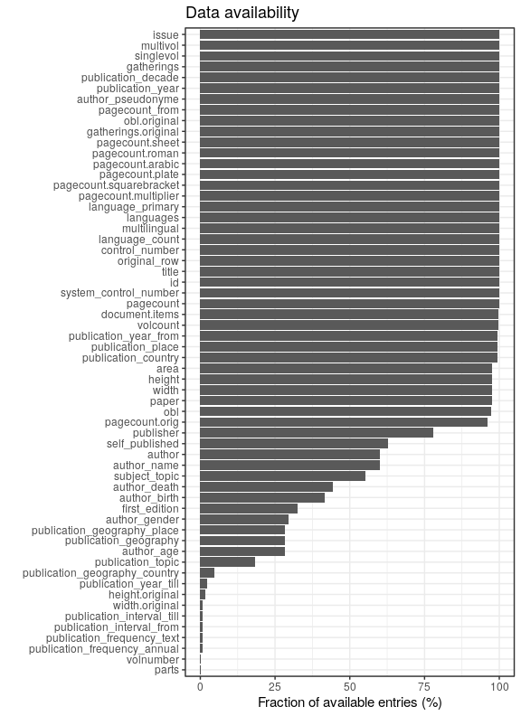
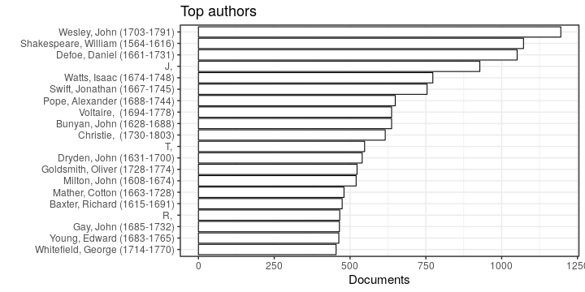
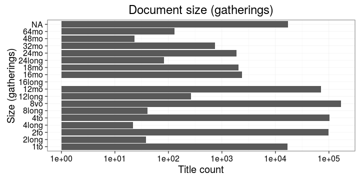
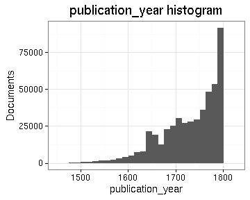

# Summary

## Field conversions

This documents the conversions from raw data to the final preprocessed version (accepted, discarded, conversions). Only some of the key tables are explicitly linked below. The complete list of all summary tables is [here](output.tables/).

## Annotated documents

Fraction of documents with entries for each annotation field (final preprocessed data).

Documents with data (number and percentage) and number of unique entries for each field:

|field_name            |    missing|   available|      n| unique_entries|
|:---------------------|----------:|-----------:|------:|--------------:|
|volnumber             | 99.5780626|   0.4219374|   2033|             24|
|width.original        | 99.2235770|   0.7764230|   3741|             72|
|height.original       | 98.3041561|   1.6958439|   8171|             88|
|publication_year_till | 97.8112385|   2.1887615|  10546|            354|
|author_birth          | 58.6011519|  41.3988481| 199470|            484|
|author_death          | 55.7295699|  44.2704301| 213306|            519|
|author_gender         | 51.0299383|  48.9700617| 235950|              3|
|author                | 47.3512167|  52.6487833| 253675|          46678|
|topic                 | 44.8808177|  55.1191823| 265578|          55809|
|author_name           | 44.4954081|  55.5045919| 267435|          42291|
|publisher             | 24.4015981|  75.5984019| 364252|         161375|
|latitude              | 13.9071240|  86.0928760| 414817|             16|
|longitude             | 13.9071240|  86.0928760| 414817|             16|
|paper.consumption.km2 |  7.5535724|  92.4464276| 445430|           5317|
|pagecount.orig        |  5.3579619|  94.6420381| 456009|           1137|
|country               |  4.2573548|  95.7426452| 461312|             35|
|obl                   |  3.5492139|  96.4507861| 464724|              3|
|width                 |  2.2927411|  97.7072589| 470778|             78|
|height                |  2.2927411|  97.7072589| 470778|             95|
|area                  |  2.2927411|  97.7072589| 470778|            629|
|publication_place     |  1.8178799|  98.1821201| 473066|            476|
|volcount              |  0.4219374|  99.5780626| 479792|            152|
|publication_year_from |  0.3652778|  99.6347222| 480065|            348|
|pagecount             |  0.0527162|  99.9472838| 481571|           1263|
|title                 |  0.0004151|  99.9995849| 481823|         361042|
|row.index             |  0.0000000| 100.0000000| 481825|         481825|
|language.finnish      |  0.0000000| 100.0000000| 481825|              1|
|language.swedish      |  0.0000000| 100.0000000| 481825|              2|
|language.latin        |  0.0000000| 100.0000000| 481825|              2|
|language.german       |  0.0000000| 100.0000000| 481825|              2|
|language.english      |  0.0000000| 100.0000000| 481825|              2|
|language.french       |  0.0000000| 100.0000000| 481825|              2|
|language.russian      |  0.0000000| 100.0000000| 481825|              2|
|language.greek        |  0.0000000| 100.0000000| 481825|              2|
|language.danish       |  0.0000000| 100.0000000| 481825|              2|
|language.italian      |  0.0000000| 100.0000000| 481825|              2|
|language.hebrew       |  0.0000000| 100.0000000| 481825|              2|
|language.dutch        |  0.0000000| 100.0000000| 481825|              2|
|language.spanish      |  0.0000000| 100.0000000| 481825|              2|
|language.sami         |  0.0000000| 100.0000000| 481825|              1|
|language.modern_greek |  0.0000000| 100.0000000| 481825|              2|
|language.icelandic    |  0.0000000| 100.0000000| 481825|              2|
|language.arabic       |  0.0000000| 100.0000000| 481825|              2|
|language.portuguese   |  0.0000000| 100.0000000| 481825|              2|
|language.finnougrian  |  0.0000000| 100.0000000| 481825|              1|
|language.multiple     |  0.0000000| 100.0000000| 481825|              2|
|language.undetermined |  0.0000000| 100.0000000| 481825|              1|
|original_row          |  0.0000000| 100.0000000| 481825|         481825|
|gatherings.original   |  0.0000000| 100.0000000| 481825|             18|
|obl.original          |  0.0000000| 100.0000000| 481825|              2|
|unity                 |  0.0000000| 100.0000000| 481825|              1|
|publication_year      |  0.0000000| 100.0000000| 481825|            348|
|publication_decade    |  0.0000000| 100.0000000| 481825|             37|
|gatherings            |  0.0000000| 100.0000000| 481825|             18|

## Authors

[Accepted author names](output.tables/author_accepted.csv)

[Discarded author names](output.tables/author_discarded.csv)

[Author name conversions](output.tables/author_conversion_nontrivial.csv)

Top-20 uniquely identified authors and number of documents for each (duplicate docs not checked yet). In total, there are 46678 unique authors and 253675 documents with unambiguous author information (56%).

Title count versus paper consumption (all authors):

### Ambiguous authors

Authors with ambiguous living year information - can we spot here
cases where these are clearly known identical or distinct authors?
Should also add living year information from supporting sources later.

[Authors with ambiguous life years](output.tables/author_life_ambiguous.csv)

[Authors with missing life years](output.tables/authors_missing_lifeyears.csv)

### Publication timeline for top authors

Title count

## Publication 

### Publication places

[Publication countries](output.tables/country_accepted.csv)

[Publication country not identified](output.tables/country_discarded.csv)

[Discarded publication places](output.tables/publication_place_discarded.csv)

[Publication place conversions](output.tables/publication_place_conversion_nontrivial.csv)

[Places missing geocoordinate information](output.tables/absentgeocoordinates.csv)

Top-20 publication places are shown together with the number of documents. This info is available for 473066 documents (98%). There are 476 unique publication places. Overall 86.1% of the places could be matched to geographic coordinates (from the [Geonames](http://download.geonames.org/export/dump/) database).

|name        |      n|   fraction|
|:-----------|------:|----------:|
|England     | 365169| 75.7887200|
|Scotland    |  39397|  8.1766201|
|Ireland     |  28499|  5.9148031|
|USA         |  19819|  4.1133192|
|France      |   3073|  0.6377834|
|Netherlands |   1943|  0.4032584|

### Publishers

[Publishers accepted](output.tables/publisher_accepted.csv)

[Publishers discarded](output.tables/publisher_discarded.csv)

The 20 most common publishers are shown with the number of documents. Publisher information is available for 364252 documents (76%). There are 161986 unique publisher names (some may be synonymes, though).

### Publication timeline for top publishers

Title count versus paper consumption (top publishers):

|publisher                             | titles|    paper|
|:-------------------------------------|------:|--------:|
|author                                |   1990| 4.156793|
|charles eyre william strahan          |   1585| 8.269442|
|company stationers                    |    952| 1.256779|
|george eyre andrew strahan            |    943| 6.206504|
|thomas baskett assigns robert baskett |   1106| 6.436823|

### Publication year

[Publication year conversions](output.tables/publication_year_conversion_nontrivial.csv)

[Publication year discarded](output.tables/publication_year_discarded.csv)

Publication year is available for 481825 documents (100%). The publication years span 1462-1826

### Titles

Top-20 titles are shown together with the number of documents. This info is available for 481823 documents (100%). There are 361042 unique titles.

## Language

Title count for the 20 unique languages. Some documents have more than one language listed.

[Unrecognized language entries](output.tables/language_unidentified.csv)  

## Page counts

[Page conversions from raw data to final page count estimates](https://raw.githubusercontent.com/rOpenGov/estc/master/inst/examples/output.tables/pagecount_conversion_nontrivial.csv)

[Discarded pagecount info](https://raw.githubusercontent.com/rOpenGov/estc/master/inst/examples/output.tables/pagecount_discarded.csv)

## Document size comparisons

[Dimension conversion table](https://raw.githubusercontent.com/rOpenGov/estc/master/inst/examples/output.tables/conversions_physical_dimension.csv)

Document size (area) info in area is available for 470778 documents (98%). Estimates of document size (area) info in gatherings system are available for 481825 documents (100%). 

Compare gatherings and area sizes as a quality check. This includes all data; the area has been estimated from the gatherings when dimension information was not available.

Compare gatherings and page counts. Page count information is estimated for 0 documents and updated (changed) for 6983 documents. 

Compare original gatherings and original heights where both are available. The point size indicates the number of documents with the corresponding combination. The red dots indicate the estimated height that is used when only gathering information is available. It seems that in most documents, the given height is smaller than the correponding estimate.

### Gatherings timelines

## Average page counts 

Multi-volume documents average page counts are given per volume.

|doc.dimension | mean.pages.singlevol| median.pages.singlevol| n.singlevol| mean.pages.multivol| median.pages.multivol| n.multivol| mean.pages.issue| median.pages.issue| n.issue|
|:-------------|--------------------:|----------------------:|-----------:|-------------------:|---------------------:|----------:|----------------:|------------------:|-------:|
|1to           |              2.00000|                    2.0|       15914|                  NA|                    NA|         NA|               NA|                 NA|      NA|
|2long         |             98.78947|                   27.0|          38|                  NA|                    NA|         NA|         28.94737|                 24|      19|
|2fo           |             81.08823|                   16.0|       98944|           350.30849|              373.0000|       2995|         28.59875|                 26|   32219|
|4long         |             31.33333|                    8.0|          21|                 NaN|                    NA|          1|         13.14286|                  8|       7|
|4to           |                 -Inf|                   32.0|      101359|            43.27995|               24.0000|       4748|         26.25483|                 24|   35317|
|8long         |            109.58537|                   20.0|          41|            16.00000|               16.0000|          1|         18.37500|                 16|      16|
|8vo           |                 -Inf|                   42.0|      167839|           202.04245|              200.0000|      12304|         26.14501|                 24|   56425|
|12long        |             87.51311|                   24.0|         267|             6.00000|                6.0000|         11|         24.67647|                 24|     136|
|12mo          |            103.98107|                   42.0|       71054|            35.28818|               27.0000|       6497|         25.80235|                 24|   25940|
|16long        |              2.00000|                    2.0|           1|                  NA|                    NA|         NA|               NA|                 NA|      NA|
|16mo          |             87.22574|                   24.0|        2371|            88.17687|               79.0000|        111|         23.95657|                 24|     829|
|18mo          |            129.47905|                   48.0|        2030|           115.20468|              120.0000|        175|         27.25916|                 26|     737|
|24long        |            105.69512|                   30.0|          82|           371.00000|              371.0000|          4|         27.06250|                 24|      32|
|24mo          |            122.68486|                   40.0|        1871|           234.19355|              238.0000|         98|         27.06327|                 26|     648|
|32mo          |            115.32657|                   32.0|         746|           237.54082|              237.5408|         47|         23.49612|                 24|     258|
|48mo          |             91.40476|                   58.5|          23|                  NA|                    NA|         NA|         26.00000|                 18|       5|
|64mo          |            145.02804|                   76.0|         130|            31.00000|               31.0000|          1|         31.87500|                 34|      32|
|NA            |             49.54317|                    2.0|       17061|           156.30515|              150.6667|        383|         23.79863|                 24|    3064|

## Average document dimensions 

|gatherings | mean.height| median.height| mean.width| median.width|      n|
|:----------|-----------:|-------------:|----------:|------------:|------:|
|1to        |   88.176008|     88.176008|  61.685874|    61.685874|  15914|
|2long      |   50.407895|     50.407895|  32.421053|    32.421053|     38|
|2fo        |   45.738746|     45.738746|  31.117988|    31.117988|  99141|
|4long      |   32.590909|     32.590909|  29.000000|    29.000000|     22|
|4to        |   27.933993|     27.933993|  22.012871|    22.012871| 102247|
|8long      |   21.121951|     21.121951|  13.878049|    13.878049|     41|
|8vo        |   18.985350|     18.985350|  13.015510|    13.015510| 168538|
|12long     |   20.000000|     20.000000|  13.000000|    13.000000|    267|
|12mo       |   18.971124|     18.971124|  12.524103|    12.524103|  71235|
|16mo       |   14.853188|     14.853188|  12.072148|    12.072148|   2384|
|18mo       |   15.986726|     15.986726|  10.002458|    10.002458|   2034|
|24long     |   13.891566|     13.891566|   9.608434|     9.608434|     83|
|24mo       |   12.474147|     12.474147|   8.523454|     8.523454|   1876|
|32mo       |   11.973333|     11.973333|   7.026667|     7.026667|    750|
|48mo       |    9.565217|      9.565217|   6.956522|     6.956522|     23|
|64mo       |    7.000000|      7.000000|   5.000000|     5.000000|    130|
|NA         |   29.724694|     29.724694|  20.219805|    20.219805|   6054|

## Histograms of all entries for numeric variables

## Histograms of the top entries for factor variables

