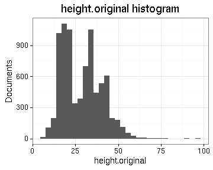
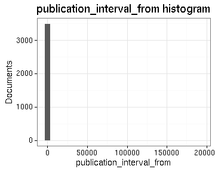

# Summary of the preprocessed ESTC data

## Field conversions

This document links to files that summarize the conversions from raw data to the final preprocessed version (accepted, discarded, conversions). Only some of the key tables are explicitly linked below. The complete list of those summary tables is available [here](output.tables/).


## Annotated documents

Fraction of documents with entries for each annotation field (final preprocessed data).

 

Number of documents with NA entries (number and percentage) and number of unique entries for each field:


```
## Error in tab[, "available"]: subscript out of bounds
```


|                      |  docs| percentage| unique|
|:---------------------|-----:|----------:|------:|
|row.index             | 50277|  1.0000000|  50277|
|original_row          | 50277|  1.0000000|  50277|
|language              | 50270|  0.9998608|     21|
|title                 | 50277|  1.0000000|  41289|
|topic                 | 21965|  0.4368797|   7065|
|volnumber             |   156|  0.0031028|     15|
|volcount              | 50121|  0.9968972|    109|
|author_name           | 18231|  0.3626111|   6097|
|pagecount             | 50232|  0.9991050|    998|
|publication_place     | 49784|  0.9901943|    411|
|gatherings            | 50277|  1.0000000|     16|
|width                 | 48091|  0.9565209|     52|
|height                | 48091|  0.9565209|     47|
|obl                   | 50277|  1.0000000|      2|
|area                  | 48091|  0.9565209|    299|
|publisher             | 42460|  0.8445214|  22255|
|author_birth          | 15338|  0.3050699|    351|
|author_death          | 15953|  0.3173021|    370|
|publication_year      | 49913|  0.9927601|    327|
|unity                 | 50277|  1.0000000|      1|
|publication_decade    | 49888|  0.9922629|     43|
|latitude              | 44951|  0.8940669|    133|
|longitude             | 44951|  0.8940669|    133|
|publication_country   | 48291|  0.9604988|     32|
|pagecount.orig        | 48677|  0.9681763|    939|
|author_unique         | 19421|  0.3862800|   6756|
|author_gender         | 16899|  0.3361179|      3|
|paper.consumption.km2 | 48056|  0.9558247|   2816|


## Topics


Top-20 topics and number of documents for each. In total, there are 7065 unique topics and 21965 documents assigned to one or more topics (44).

 


## Authors

Top-20 uniquely identified authors and number of documents for each (duplicate docs not checked yet). In total, there are 6756 unique authors and 19421 documents with unambiguous author information (36%).

 

[Discarded author names](output.tables/author_name_discarded.csv)

[Discarded author first names](output.tables/author_name_discarded_first.csv)

[Discarded author last names](output.tables/author_name_discarded_last.csv)


### Gender

[Author genders](output.tables/author_gender_accepted.csv)

[Male authors](output.tables/gender_male.csv)

[Female authors](output.tables/gender_male.csv)

[Names with missing gender](output.tables/gender_unknown.csv)


Author gender distribution in the complete data:


|author_gender |  docs| fraction|
|:-------------|-----:|--------:|
|female        |   475|     0.94|
|male          | 16424|    32.67|
|NA            | 33378|    66.39|

Author gender distribution over time. Note that the name-gender mappings change over time. This has not been taken into account yet.


 


### Ambiguous authors

Authors with ambiguous living year information - can we spot here
cases where these are clearly known identical or distinct authors?
Should also add living year information from supporting sources later.

[Authors with ambiguous life years](output.tables/author_life_ambiguous.csv)

[Authors with discarded life years](output.tables/author_life_discarded.csv)

[Authors with missing life years](output.tables/author_birth_unknown.csv)


### Life span of uniquely identified top authors

Ordered by productivity (number of documents))

 

### Publication timeline for top-10 authors

Title count

 


Paper consumption

 


## Publication 

### Publication places

Top-20 publication places are shown together with the number of documents. This info is available for 49784 documents (99%). There are 411 unique publication places. Overall 89.4% of the places could be matched to geographic coordinates (from the [Geonames](http://download.geonames.org/export/dump/) database).

[Publication countries](output.tables/publication_country_accepted.csv)

[Publication country missing](output.tables/publication_country_discarded.csv)

[Discarded publication places](output.tables/publication_place_discarded.csv)

[Publication place conversions](output.tables/publication_place_conversions_nontrivial.csv)

[Places missing geocoordinate information](output.tables/absentgeocoordinates.csv)


 


|            |     n|
|:-----------|-----:|
|England     | 38524|
|Ireland     |  3501|
|Scotland    |  2863|
|USA         |  2463|
|Netherlands |   309|
|France      |   300|
|Germany     |    58|
|Canada      |    52|
|Switzerland |    45|
|Belgium     |    42|
|India       |    40|
|Jamaica     |    25|
|Northern    |    10|
|Barbados    |    10|
|Italy       |     9|
|Saint       |     8|
|Bahamas     |     6|
|Dominica    |     4|
|Haiti       |     3|
|Guadaloupe  |     3|
|Denmark     |     3|
|Sweden      |     2|
|Spain       |     2|
|Austria     |     2|
|Walkes      |     1|
|unknown     |     1|
|Russia      |     1|
|Poland      |     1|
|Guernesey   |     1|
|Grenada     |     1|
|Europe      |     1|


### Publishers


The 20 most common publishers are shown with the number of documents. Publisher information is available for 42460 documents (84%). There are 22254 unique publisher names (some may be synonymes, though).


 


[Publishers accepted](output.tables/publisher_accepted.csv)

[Publishers discarded](output.tables/publisher_discarded.csv)


### Publication timeline for top-10 publishers

Title count

 


Paper consumption


```
## Warning: Removed 1 rows containing missing values (position_stack).
```

```
## Warning: Removed 1 rows containing missing values (position_stack).
```

```
## Warning: Removed 1 rows containing missing values (position_stack).
```

 


### Publication year

Publication year is available for 49913 documents (99%). The publication years span 0-1799

 

Zooming in 1470-1799

 


[Publication year conversions](output.tables/publication_year_conversion_table.csv)

[Publication year discarded](output.tables/publication_year_failed.csv)


### Titles

Top-20 titles are shown together with the number of documents. This info is available for 50277 documents (100%). There are 41289 unique titles.

[Publication titles](output.tables/title_accepted.csv)

[Publication titles discarded](output.tables/title_discarded.csv)

[Title harmonization table](output.tables/title_conversions_nontrivial.csv)

 


## Language

The 21 unique languages are shown together with the number of documents. This info is available for 50270 documents (100%). 

 


## Page counts

[Page conversions from raw data to final page count estimates](https://raw.githubusercontent.com/rOpenGov/estc/master/inst/examples/output.tables/page_conversion_table_brief.csv)

[Page conversions from raw data to final page count estimates with volume info](https://raw.githubusercontent.com/rOpenGov/estc/master/inst/examples/output.tables/page_conversion_table_full.csv)

[Discarded page info](https://raw.githubusercontent.com/rOpenGov/estc/master/inst/examples/output.tables/documentpages-discarded.csv)


## Document size comparisons

[Discarded dimension info](https://raw.githubusercontent.com/rOpenGov/estc/master/inst/examples/output.tables/dimensions_discarded.csv)

[Dimension conversion table](https://raw.githubusercontent.com/rOpenGov/estc/master/inst/examples/output.tables/dimension_conversion_table.csv)


Document size (area) info in area is available for 48091 documents (96%). Estimates of document size (area) info in gatherings system are available for 50277 documents (100%). 

 

Compare gatherings and area sizes as a quality check. This includes all data; the area has been estimated from the gatherings when dimension information was not available.

 

Document dimension histogram (surface area). Few document sizes dominate publishing.

 


Compare gatherings and page counts. Page count information is estimated for -1555 documents and updated (changed) for 1093 documents. 

 

Compare original gatherings and original heights where both are available. The point size indicates the number of documents with the corresponding combination. The red dots indicate the estimated height that is used when only gathering information is available. It seems that in most documents, the given height is smaller than the correponding estimate.

 

## Average page counts 

Multi-volume documents average page counts are given per volume.


|doc.dimension | mean.pages.singlevol| median.pages.singlevol| n.singlevol| mean.pages.multivol| median.pages.multivol| n.multivol| mean.pages.issue| median.pages.issue| n.issue|
|:-------------|--------------------:|----------------------:|-----------:|-------------------:|---------------------:|----------:|----------------:|------------------:|-------:|
|1to           |             2.481936|                      2|        4249|                  NA|                    NA|         NA|         10.43590|                  8|      39|
|2long         |             7.714286|                      5|           8|                  NA|                    NA|         NA|         23.00000|                 23|       1|
|2fo           |            61.819404|                      4|       11532|            724.6260|              716.0000|         46|         16.83934|                 12|    1942|
|4long         |             5.000000|                      5|           4|                  NA|                    NA|         NA|               NA|                 NA|      NA|
|4to           |            43.761757|                     12|       16528|            412.8611|              439.0000|         27|         15.87323|                  8|   12187|
|8vo           |           143.591194|                     68|       11599|            406.7586|              413.3333|        181|         28.46772|                 28|    3810|
|12long        |            67.000000|                     50|          10|             24.0000|               24.0000|          1|         28.80000|                 24|       5|
|12mo          |           184.148054|                    162|        3021|            260.5657|              211.0000|         47|         26.26923|                 24|     520|
|16mo          |           163.645570|                    116|          81|                  NA|                    NA|         NA|         30.46154|                 24|      13|
|18mo          |           177.575758|                    158|          33|            172.0000|              172.0000|          1|         41.00000|                 41|       2|
|24long        |           244.000000|                    244|           1|                  NA|                    NA|         NA|               NA|                 NA|      NA|
|24mo          |           193.525000|                    181|          43|                  NA|                    NA|          2|         23.27273|                 24|      11|
|32mo          |           182.000000|                    193|           6|                  NA|                    NA|         NA|               NA|                 NA|      NA|
|48mo          |           128.000000|                    128|           1|                  NA|                    NA|         NA|               NA|                 NA|      NA|
|64mo          |           197.000000|                    197|           2|                  NA|                    NA|         NA|               NA|                 NA|      NA|
|NA            |            14.083557|                      2|        3003|                  NA|                    NA|         NA|         18.87593|                 15|     403|


 


## Average document dimensions 

 


|gatherings | mean.height| median.height| mean.width| median.width|     n|
|:----------|-----------:|-------------:|----------:|------------:|-----:|
|1to        |    59.97152|      59.97152|   89.95575|     89.95575|  3616|
|2fo        |    31.37527|      31.37527|   47.09737|     47.09737| 12170|
|4to        |    21.91628|      21.91628|   27.87294|     27.87294| 16543|
|8vo        |    13.01510|      13.01510|   19.02952|     19.02952| 11719|
|12mo       |    12.49440|      12.49440|   18.98666|     18.98666|  3035|
|16mo       |    12.00000|      12.00000|   15.00000|     15.00000|    81|
|18mo       |    10.00000|      10.00000|   16.00000|     16.00000|    33|
|24mo       |     8.50000|       8.50000|   12.50000|     12.50000|    45|
|NA         |    20.98898|      20.98898|   31.65239|     31.65239|   817|

## Histograms of all entries for numeric variables

             

## Histograms of the top entries for factor variables

     

```
## Error in dfs[1:ntop, ]: incorrect number of dimensions
```

 


<!--
### Testing rCharts example - perhaps only in HTML with knit2html
<iframe srcdoc=' &lt;!doctype HTML&gt;
&lt;meta charset = &#039;utf-8&#039;&gt;
&lt;html&gt;
  &lt;head&gt;
    
    &lt;link rel=&#039;stylesheet&#039; href=&#039;//cdnjs.cloudflare.com/ajax/libs/nvd3/1.1.15-beta/nv.d3.min.css&#039;&gt;
    
    
    
    &lt;script src=&#039;//ajax.googleapis.com/ajax/libs/jquery/1.8.2/jquery.min.js&#039; type=&#039;text/javascript&#039;&gt;&lt;/script&gt;
    
    &lt;script src=&#039;//d3js.org/d3.v3.min.js&#039; type=&#039;text/javascript&#039;&gt;&lt;/script&gt;
    
    &lt;script src=&#039;//cdnjs.cloudflare.com/ajax/libs/nvd3/1.1.15-beta/nv.d3.min.js&#039; type=&#039;text/javascript&#039;&gt;&lt;/script&gt;
    
    &lt;script src=&#039;//nvd3.org/assets/lib/fisheye.js&#039; type=&#039;text/javascript&#039;&gt;&lt;/script&gt;
    
    
    &lt;style&gt;
    .rChart {
      display: block;
      margin-left: auto; 
      margin-right: auto;
      width: 800px;
      height: 400px;
    }  
    &lt;/style&gt;
    
  &lt;/head&gt;
  &lt;body &gt;
    
    &lt;div id = &#039;chart663a328575af&#039; class = &#039;rChart nvd3&#039;&gt;&lt;/div&gt;    
    &lt;script type=&#039;text/javascript&#039;&gt;
 $(document).ready(function(){
      drawchart663a328575af()
    });
    function drawchart663a328575af(){  
      var opts = {
 &quot;dom&quot;: &quot;chart663a328575af&quot;,
&quot;width&quot;:    800,
&quot;height&quot;:    400,
&quot;x&quot;: &quot;Hair&quot;,
&quot;y&quot;: &quot;Freq&quot;,
&quot;group&quot;: &quot;Eye&quot;,
&quot;type&quot;: &quot;multiBarChart&quot;,
&quot;id&quot;: &quot;chart663a328575af&quot; 
},
        data = [
 {
 &quot;Hair&quot;: &quot;Black&quot;,
&quot;Eye&quot;: &quot;Brown&quot;,
&quot;Sex&quot;: &quot;Male&quot;,
&quot;Freq&quot;:             32 
},
{
 &quot;Hair&quot;: &quot;Brown&quot;,
&quot;Eye&quot;: &quot;Brown&quot;,
&quot;Sex&quot;: &quot;Male&quot;,
&quot;Freq&quot;:             53 
},
{
 &quot;Hair&quot;: &quot;Red&quot;,
&quot;Eye&quot;: &quot;Brown&quot;,
&quot;Sex&quot;: &quot;Male&quot;,
&quot;Freq&quot;:             10 
},
{
 &quot;Hair&quot;: &quot;Blond&quot;,
&quot;Eye&quot;: &quot;Brown&quot;,
&quot;Sex&quot;: &quot;Male&quot;,
&quot;Freq&quot;:              3 
},
{
 &quot;Hair&quot;: &quot;Black&quot;,
&quot;Eye&quot;: &quot;Blue&quot;,
&quot;Sex&quot;: &quot;Male&quot;,
&quot;Freq&quot;:             11 
},
{
 &quot;Hair&quot;: &quot;Brown&quot;,
&quot;Eye&quot;: &quot;Blue&quot;,
&quot;Sex&quot;: &quot;Male&quot;,
&quot;Freq&quot;:             50 
},
{
 &quot;Hair&quot;: &quot;Red&quot;,
&quot;Eye&quot;: &quot;Blue&quot;,
&quot;Sex&quot;: &quot;Male&quot;,
&quot;Freq&quot;:             10 
},
{
 &quot;Hair&quot;: &quot;Blond&quot;,
&quot;Eye&quot;: &quot;Blue&quot;,
&quot;Sex&quot;: &quot;Male&quot;,
&quot;Freq&quot;:             30 
},
{
 &quot;Hair&quot;: &quot;Black&quot;,
&quot;Eye&quot;: &quot;Hazel&quot;,
&quot;Sex&quot;: &quot;Male&quot;,
&quot;Freq&quot;:             10 
},
{
 &quot;Hair&quot;: &quot;Brown&quot;,
&quot;Eye&quot;: &quot;Hazel&quot;,
&quot;Sex&quot;: &quot;Male&quot;,
&quot;Freq&quot;:             25 
},
{
 &quot;Hair&quot;: &quot;Red&quot;,
&quot;Eye&quot;: &quot;Hazel&quot;,
&quot;Sex&quot;: &quot;Male&quot;,
&quot;Freq&quot;:              7 
},
{
 &quot;Hair&quot;: &quot;Blond&quot;,
&quot;Eye&quot;: &quot;Hazel&quot;,
&quot;Sex&quot;: &quot;Male&quot;,
&quot;Freq&quot;:              5 
},
{
 &quot;Hair&quot;: &quot;Black&quot;,
&quot;Eye&quot;: &quot;Green&quot;,
&quot;Sex&quot;: &quot;Male&quot;,
&quot;Freq&quot;:              3 
},
{
 &quot;Hair&quot;: &quot;Brown&quot;,
&quot;Eye&quot;: &quot;Green&quot;,
&quot;Sex&quot;: &quot;Male&quot;,
&quot;Freq&quot;:             15 
},
{
 &quot;Hair&quot;: &quot;Red&quot;,
&quot;Eye&quot;: &quot;Green&quot;,
&quot;Sex&quot;: &quot;Male&quot;,
&quot;Freq&quot;:              7 
},
{
 &quot;Hair&quot;: &quot;Blond&quot;,
&quot;Eye&quot;: &quot;Green&quot;,
&quot;Sex&quot;: &quot;Male&quot;,
&quot;Freq&quot;:              8 
} 
]
  
      if(!(opts.type===&quot;pieChart&quot; || opts.type===&quot;sparklinePlus&quot; || opts.type===&quot;bulletChart&quot;)) {
        var data = d3.nest()
          .key(function(d){
            //return opts.group === undefined ? &#039;main&#039; : d[opts.group]
            //instead of main would think a better default is opts.x
            return opts.group === undefined ? opts.y : d[opts.group];
          })
          .entries(data);
      }
      
      if (opts.disabled != undefined){
        data.map(function(d, i){
          d.disabled = opts.disabled[i]
        })
      }
      
      nv.addGraph(function() {
        var chart = nv.models[opts.type]()
          .width(opts.width)
          .height(opts.height)
          
        if (opts.type != &quot;bulletChart&quot;){
          chart
            .x(function(d) { return d[opts.x] })
            .y(function(d) { return d[opts.y] })
        }
          
         
        
          
        

        
        
        
      
       d3.select(&quot;#&quot; + opts.id)
        .append(&#039;svg&#039;)
        .datum(data)
        .transition().duration(500)
        .call(chart);

       nv.utils.windowResize(chart.update);
       return chart;
      });
    };
&lt;/script&gt;
    
    &lt;script&gt;&lt;/script&gt;    
  &lt;/body&gt;
&lt;/html&gt; ' scrolling='no' frameBorder='0' seamless class='rChart  nvd3  ' id='iframe-chart663a328575af'> </iframe>
 <style>iframe.rChart{ width: 100%; height: 400px;}</style>
-->

