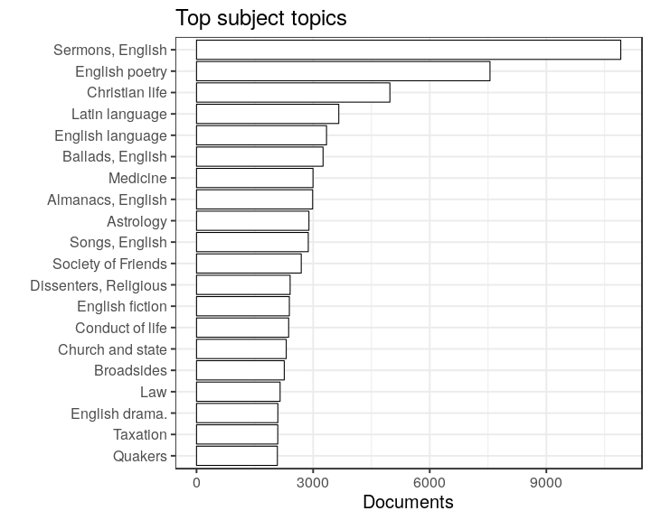

# Summary of the preprocessed ESTC data


## Annotated documents

Fraction of documents with entries for each annotation field (final preprocessed data).

 


## Topics


```
## [1] "Complete subject topic counts in file: output.tables/subjecttopics.tab"
```

Top-50 topics and number of documents for each. In total, there are 0 unique topics and 0 documents assigned to one or more topics (NaN).


```
## Error in dfs[1:ntop, ]: incorrect number of dimensions
```

 


## Authors

Top-50 uniquely identified authors and number of documents for each (duplicate docs not checked yet). In total, there are 0 unique authors and 0 documents with unambiguous author information (NaN%).


```
## Error in dfs[1:ntop, ]: incorrect number of dimensions
```

 


### Gender

Gender distribution for authors over time. Note that the name-gender mappings change over time. This has not been taken into account yet.


```
## 
## female   male 
##  0.028  0.972
```


```
## Error in eval(expr, envir, enclos): unknown column 'publication.decade'
```

```
## Error in regression_plot(p.female ~ publication.decade, dfd, main = "Female authors proportion"): object 'dfd' not found
```

 


### Ambiguous authors

Authors with ambiguous living year information - can we spot here
cases where these are clearly known identical or distinct authors?
Should also add living year information from supporting sources later.


```
## Error in eval(expr, envir, enclos): object 'author.unique' not found
```

```
## Error in split.default(dfs$author.birth, dfs$author.name): first argument must be a vector
```

```
## Error in split.default(dfs$author.death, dfs$author.name): first argument must be a vector
```

```
## Error in lapply(deaths[names(which(sapply(deaths, function(x) {: object 'deaths' not found
```

```
## Error in match(x, table, nomatch = 0L): object 'author.name' not found
```

```
## Error in `[.data.frame`(dfs, , c("author.name", "author.birth", "author.death")): undefined columns selected
```

```
## Error in order(dfs$author.name): argument 1 is not a vector
```


|     |author_name                                          |author_birth |author_death |
|:----|:----------------------------------------------------|:------------|:------------|
|1    |Adams, John                                          |1735         |1826         |
|5    |Adams, John                                          |1750         |1814         |
|8    |Alexander, William                                   |1685         |1704         |
|9    |Alexander, William                                   |1783         |1783         |
|14   |Alexander, William                                   |NA           |1783         |
|15   |Allen, John                                          |1741         |1774         |
|22   |Allen, John                                          |1763         |1812         |
|23   |Allen, John                                          |NA           |NA           |
|24   |Anderson, James                                      |1589         |1589         |
|25   |Anderson, James                                      |1662         |1728         |
|27   |Anderson, James                                      |1680         |1739         |
|40   |Anderson, James                                      |1739         |1808         |
|45   |Antraigues, Emmanuel-louis-henri-alexandre De Launay |1753         |1812         |
|46   |Antraigues, Emmanuel-louis-henri-alexandre De Launay |1754         |1812         |
|48   |Argyll, Archibald Campbell                           |1598         |1661         |
|64   |Argyll, Archibald Campbell                           |1629         |1685         |
|65   |Armstrong, John                                      |1758         |1758         |
|66   |Armstrong, John                                      |1771         |1758         |
|67   |Atholl, John Murray                                  |1660         |1724         |
|69   |Atholl, John Murray                                  |1729         |1774         |
|70   |Bagshaw, Edward                                      |1629         |1662         |
|72   |Bagshaw, Edward                                      |1662         |1662         |
|74   |Bellamy, D                                           |1687         |1687         |
|77   |Bellamy, D                                           |1788         |1788         |
|78   |Black, William                                       |1745         |1745         |
|85   |Black, William                                       |1749         |1745         |
|86   |Brown, Andrew                                        |1679         |1706         |
|87   |Brown, Andrew                                        |1744         |1797         |
|88   |Brown, Andrew                                        |1763         |1834         |
|89   |Brown, John                                          |1610         |1679         |
|91   |Brown, John                                          |1715         |1766         |
|94   |Brown, John                                          |1722         |1787         |
|98   |Brown, John                                          |1735         |1788         |
|99   |Brown, John                                          |NA           |NA           |
|100  |Brown, Thomas                                        |1663         |1704         |
|105  |Brown, Thomas                                        |1740         |1740         |
|108  |Browne, John                                         |1580         |1659         |
|109  |Browne, John                                         |1700         |1700         |
|110  |Browne, John                                         |NA           |NA           |
|113  |Browne, Thomas                                       |1604         |1673         |
|114  |Browne, Thomas                                       |1605         |1682         |
|115  |Browne, Thomas                                       |1654         |1741         |
|116  |Browne, Thomas                                       |NA           |NA           |
|117  |Buckingham, George Villiers                          |1592         |1628         |
|118  |Buckingham, George Villiers                          |1628         |1687         |
|125  |Burnet, Gilbert                                      |1643         |1715         |
|222  |Burnet, Gilbert                                      |1690         |1726         |
|226  |Burnet, Thomas                                       |1635         |1715         |
|227  |Burnet, Thomas                                       |1694         |1753         |
|236  |Burney, Charles                                      |1726         |1814         |
|240  |Burney, Charles                                      |1757         |1817         |
|241  |Calamy, Edmund                                       |1600         |1666         |
|251  |Calamy, Edmund                                       |1671         |1732         |
|258  |Camm, John                                           |1604         |1656         |
|259  |Camm, John                                           |1779         |1779         |
|262  |Canne, John                                          |1667         |1667         |
|269  |Canne, John                                          |1766         |1766         |
|270  |Cellier, Elizabeth                                   |1650         |1650         |
|271  |Cellier, Elizabeth                                   |1680         |1680         |
|273  |Chaloner, Thomas                                     |1521         |1565         |
|275  |Chaloner, Thomas                                     |1595         |1661         |
|277  |Checkley, Samuel                                     |1696         |1769         |
|278  |Checkley, Samuel                                     |1723         |1768         |
|279  |Church, Benjamin                                     |1639         |1718         |
|280  |Church, Benjamin                                     |1734         |1778         |
|288  |Clarke, John                                         |1596         |1658         |
|290  |Clarke, John                                         |1609         |1676         |
|292  |Clarke, John                                         |1755         |1798         |
|302  |Clarke, John                                         |1791         |1791         |
|303  |Clarke, Samuel                                       |1599         |1682         |
|318  |Clarke, Samuel                                       |1675         |1729         |
|321  |Clarke, Samuel                                       |1721         |1721         |
|326  |Clarke, William                                      |1696         |1771         |
|328  |Clarke, William                                      |1709         |1760         |
|330  |Cole, William                                        |1616         |1653         |
|332  |Cole, William                                        |1653         |1653         |
|333  |Comber, Thomas                                       |1645         |1699         |
|342  |Comber, Thomas                                       |1778         |1778         |
|344  |Cooke, Edward                                        |1658         |1670         |
|345  |Cooke, Edward                                        |1684         |1684         |
|346  |Cooke, Edward                                        |1755         |1820         |
|358  |Cooke, Edward                                        |NA           |NA           |
|361  |Cornwallis, Charles                                  |1629         |1629         |
|363  |Cornwallis, Charles                                  |1738         |1805         |
|364  |Cotton, John                                         |1584         |1652         |
|372  |Cotton, John                                         |1640         |1699         |
|374  |Cotton, John                                         |1712         |1789         |
|377  |Cox, Richard                                         |1650         |1733         |
|382  |Cox, Richard                                         |1702         |1766         |
|385  |Crowe, William                                       |1743         |1743         |
|386  |Crowe, William                                       |1745         |1829         |
|387  |Crowe, William                                       |NA           |1743         |
|388  |Dauncey, John                                        |1633         |1633         |
|389  |Dauncey, John                                        |1663         |1663         |
|394  |Davies, John                                         |1569         |1626         |
|406  |Davies, John                                         |1625         |1693         |
|410  |Dickinson, Jonathan                                  |1663         |1722         |
|411  |Dickinson, Jonathan                                  |1688         |1747         |
|419  |Disney, John                                         |1677         |1730         |
|420  |Disney, John                                         |1746         |1816         |
|421  |Douglas, James                                       |1651         |1651         |
|422  |Douglas, James                                       |1744         |1744         |
|423  |Downes, John                                         |1661         |1719         |
|424  |Downes, John                                         |1666         |1666         |
|425  |Downes, John                                         |1691         |1760         |
|427  |Duncan, Alexander                                    |1708         |1816         |
|428  |Duncan, Alexander                                    |1816         |1816         |
|429  |Edwards, Thomas                                      |1599         |1647         |
|440  |Edwards, Thomas                                      |1693         |1699         |
|441  |Edwards, Thomas                                      |1699         |1757         |
|444  |Edwards, Thomas                                      |1729         |1785         |
|445  |Edwards, Thomas                                      |1776         |1810         |
|446  |Elder, John                                          |1555         |1555         |
|448  |Elder, John                                          |1692         |1779         |
|449  |Eliot, John                                          |1592         |1632         |
|450  |Eliot, John                                          |1604         |1690         |
|456  |Ellis, John                                          |1606         |1681         |
|457  |Ellis, John                                          |1710         |1776         |
|458  |Ellis, John                                          |1768         |1768         |
|460  |Essex, Robert Devereux                               |1566         |1601         |
|464  |Essex, Robert Devereux                               |1591         |1646         |
|487  |Evelyn, John                                         |1620         |1706         |
|496  |Evelyn, John                                         |1655         |1699         |
|497  |Fitch, John                                          |1698         |1698         |
|498  |Fitch, John                                          |1743         |1798         |
|501  |Fleetwood, William                                   |1535         |1594         |
|502  |Fleetwood, William                                   |1656         |1723         |
|511  |Fleming, Robert                                      |1630         |1694         |
|513  |Fleming, Robert                                      |1660         |1716         |
|518  |Forbes, Duncan                                       |1644         |1704         |
|520  |Forbes, Duncan                                       |1685         |1747         |
|525  |Foulis, Henry                                        |1608         |1643         |
|526  |Foulis, Henry                                        |1635         |1669         |
|528  |Fox, George                                          |1624         |1661         |
|537  |Fox, George                                          |1661         |1661         |
|544  |Fox, William                                         |1736         |1826         |
|545  |Fox, William                                         |1791         |1813         |
|570  |Fox, William                                         |NA           |NA           |
|571  |Gage, Thomas                                         |1603         |1656         |
|572  |Gage, Thomas                                         |1721         |1787         |
|575  |Gardiner, James                                      |1637         |1705         |
|576  |Gardiner, James                                      |1723         |1723         |
|577  |Gardiner, James                                      |NA           |NA           |
|578  |Gerbier, Balthazar                                   |1562         |1667         |
|579  |Gerbier, Balthazar                                   |1592         |1667         |
|585  |Gilbert, Thomas                                      |1613         |1694         |
|587  |Gilbert, Thomas                                      |1720         |1798         |
|589  |Goodwin, Thomas                                      |1587         |1642         |
|592  |Goodwin, Thomas                                      |1600         |1680         |
|594  |Goodwin, Thomas                                      |1650         |1716         |
|595  |Gordon, Alexander                                    |1669         |1752         |
|596  |Gordon, Alexander                                    |1692         |1754         |
|598  |Gordon, John                                         |1544         |1619         |
|599  |Gordon, John                                         |1715         |1775         |
|600  |Gordon, John                                         |1717         |1790         |
|601  |Gordon, John                                         |NA           |NA           |
|602  |Grant, William                                       |1678         |1678         |
|603  |Grant, William                                       |1781         |1781         |
|604  |Grant, William                                       |NA           |NA           |
|605  |Greene, Robert                                       |1558         |1592         |
|607  |Greene, Robert                                       |1678         |1730         |
|608  |Hale, John                                           |1762         |1806         |
|609  |Hale, John                                           |1806         |1806         |
|610  |Hales, Edward                                        |1576         |1654         |
|611  |Hales, Edward                                        |1670         |1690         |
|612  |Hamilton, Charles                                    |1738         |1800         |
|613  |Hamilton, Charles                                    |1753         |1792         |
|614  |Hamilton, William                                    |1616         |1651         |
|616  |Hamilton, William                                    |1730         |1803         |
|617  |Hamilton, William                                    |NA           |NA           |
|618  |Harrington, James                                    |1611         |1677         |
|620  |Harrington, James                                    |1664         |1693         |
|622  |Harris, John                                         |1647         |1647         |
|623  |Harris, John                                         |1667         |1719         |
|628  |Harris, John                                         |1670         |1670         |
|629  |Harris, John                                         |1680         |1738         |
|630  |Harris, John                                         |1690         |1690         |
|632  |Harris, John                                         |NA           |NA           |
|637  |Harrison, John                                       |1610         |1638         |
|638  |Harrison, John                                       |1698         |1698         |
|639  |Harrison, John                                       |NA           |NA           |
|640  |Hartley, David                                       |1705         |1757         |
|642  |Hartley, David                                       |1731         |1813         |
|654  |Herbert Of Cherbury, Edward                          |1583         |1648         |
|665  |Herbert Of Cherbury, Edward                          |1633         |1678         |
|666  |Holland, John                                        |1603         |1722         |
|668  |Holland, John                                        |1722         |1722         |
|669  |Hollingworth, Richard                                |1607         |1656         |
|671  |Hollingworth, Richard                                |1639         |1701         |
|672  |Horton, Thomas                                       |1649         |1649         |
|674  |Horton, Thomas                                       |1673         |1673         |
|675  |Howell, William                                      |1632         |1683         |
|696  |Howell, William                                      |2            |1683         |
|697  |Hume, David                                          |1560         |1630         |
|703  |Hume, David                                          |1711         |1776         |
|765  |Humphreys, David                                     |1689         |1740         |
|766  |Humphreys, David                                     |1752         |1818         |
|775  |Hurrion, John                                        |1676         |1731         |
|776  |Hurrion, John                                        |1705         |1750         |
|777  |Hutchinson, William                                  |1676         |1679         |
|778  |Hutchinson, William                                  |1732         |1814         |
|782  |Jackson, John                                        |1651         |1657         |
|783  |Jackson, John                                        |1686         |1763         |
|784  |Jackson, John                                        |1742         |1742         |
|787  |Jackson, John                                        |1795         |1810         |
|789  |Jackson, William                                     |1730         |1803         |
|792  |Jackson, William                                     |1737         |1795         |
|793  |Jenkins, Joseph                                      |1702         |1736         |
|794  |Jenkins, Joseph                                      |1743         |1819         |
|795  |Johnson, R                                           |1734         |1793         |
|816  |Johnson, R                                           |1772         |1772         |
|817  |Johnson, Samuel                                      |1649         |1703         |
|825  |Johnson, Samuel                                      |1696         |1772         |
|826  |Johnson, Samuel                                      |1709         |1784         |
|834  |Johnson, William                                     |1715         |1774         |
|836  |Johnson, William                                     |1760         |1845         |
|843  |Johnson, William                                     |NA           |NA           |
|844  |Johnston, James                                      |1643         |1737         |
|845  |Johnston, James                                      |1655         |1737         |
|846  |Jones, David                                         |1676         |1720         |
|847  |Jones, David                                         |1736         |1820         |
|848  |Jones, Edward                                        |1752         |1824         |
|849  |Jones, Edward                                        |1771         |1831         |
|850  |Jones, John                                          |1645         |1709         |
|853  |Jones, John                                          |1700         |1770         |
|854  |Jones, John                                          |1786         |1827         |
|858  |Jones, William                                       |1631         |1682         |
|859  |Jones, William                                       |1726         |1800         |
|873  |Jones, William                                       |1746         |1794         |
|876  |Jones, William                                       |NA           |NA           |
|878  |Ker, John                                            |1673         |1726         |
|884  |Ker, John                                            |1741         |1741         |
|885  |King, William                                        |1650         |1729         |
|895  |King, William                                        |1663         |1712         |
|901  |King, William                                        |1685         |1763         |
|904  |Knox, John                                           |1514         |1572         |
|911  |Knox, John                                           |1720         |1790         |
|912  |Knox, John                                           |1778         |1778         |
|913  |L'estrange, Hamon                                    |1583         |1654         |
|914  |L'estrange, Hamon                                    |1605         |1660         |
|918  |Langbaine, Gerard                                    |1609         |1658         |
|923  |Langbaine, Gerard                                    |1656         |1692         |
|925  |Leland, John                                         |1691         |1766         |
|935  |Leland, John                                         |1754         |1841         |
|939  |Lindsay, David                                       |1490         |1555         |
|941  |Lindsay, David                                       |1641         |1641         |
|942  |Littleton, Edward                                    |1589         |1645         |
|945  |Littleton, Edward                                    |1626         |1626         |
|950  |Marsh, Henry                                         |1663         |1664         |
|955  |Marsh, Henry                                         |1720         |1720         |
|956  |Mason, William                                       |1672         |1709         |
|959  |Mason, William                                       |1719         |1791         |
|961  |Mason, William                                       |1725         |1797         |
|962  |May, Thomas                                          |1595         |1650         |
|983  |May, Thomas                                          |1645         |1718         |
|989  |Maynard, John                                        |1592         |1658         |
|990  |Maynard, John                                        |1602         |1690         |
|995  |Melville, James                                      |1535         |1617         |
|999  |Melville, James                                      |1556         |1614         |
|1000 |Middleton, John                                      |1619         |1674         |
|1001 |Middleton, John                                      |1680         |1744         |
|1002 |Middleton, Thomas                                    |1586         |1666         |
|1004 |Middleton, Thomas                                    |1627         |1627         |
|1006 |Middleton, Thomas                                    |NA           |NA           |
|1008 |Morgan, Edward                                       |1642         |1642         |
|1010 |Morgan, Edward                                       |1767         |1767         |
|1011 |Morgan, J                                            |1739         |1739         |
|1014 |Morgan, J                                            |1752         |1752         |
|1015 |Morgan, Thomas                                       |1679         |1679         |
|1025 |Morgan, Thomas                                       |1743         |1743         |
|1027 |Newcomb, Thomas                                      |1682         |1765         |
|1028 |Newcomb, Thomas                                      |1691         |1691         |
|1029 |Newton, William                                      |1735         |1790         |
|1030 |Newton, William                                      |1744         |1744         |
|1031 |Newton, William                                      |NA           |NA           |
|1032 |Northcote, William                                   |1648         |1648         |
|1033 |Northcote, William                                   |1783         |1783         |
|1034 |Norton, John                                         |1606         |1663         |
|1035 |Norton, John                                         |1715         |1778         |
|1036 |Ormonde, James Butler                                |1610         |1688         |
|1052 |Ormonde, James Butler                                |1665         |1745         |
|1055 |Oswald, James                                        |1711         |1769         |
|1056 |Oswald, James                                        |1793         |1793         |
|1057 |Owen, John                                           |1616         |1683         |
|1061 |Owen, John                                           |1766         |1822         |
|1062 |Owen, John                                           |NA           |NA           |
|1063 |Palmer, Samuel                                       |1724         |1724         |
|1067 |Palmer, Samuel                                       |1732         |1732         |
|1070 |Palmer, Samuel                                       |1741         |1813         |
|1071 |Parkinson, James                                     |1653         |1722         |
|1072 |Parkinson, James                                     |1755         |1824         |
|1074 |Patten, William                                      |1548         |1580         |
|1075 |Patten, William                                      |1763         |1839         |
|1076 |Pemberton, Israel                                    |1685         |1754         |
|1077 |Pemberton, Israel                                    |1715         |1779         |
|1078 |Penn, William                                        |1644         |1718         |
|1108 |Penn, William                                        |1776         |1845         |
|1109 |Pennecuik, Alexander                                 |1652         |1722         |
|1111 |Pennecuik, Alexander                                 |1730         |1730         |
|1113 |Phillips, John                                       |1570         |1591         |
|1114 |Phillips, John                                       |1631         |1706         |
|1123 |Pitt, William                                        |1708         |1778         |
|1131 |Pitt, William                                        |1759         |1806         |
|1135 |Poyntz, John                                         |1606         |1606         |
|1137 |Poyntz, John                                         |1647         |1650         |
|1139 |Preston, Thomas                                      |1537         |1598         |
|1140 |Preston, Thomas                                      |1563         |1640         |
|1141 |Preston, William                                     |1742         |1818         |
|1144 |Preston, William                                     |1753         |1807         |
|1149 |Price, John                                          |1502         |1555         |
|1151 |Price, John                                          |1625         |1691         |
|1153 |Price, John                                          |NA           |NA           |
|1167 |Prynne, William                                      |1600         |1669         |
|1307 |Prynne, William                                      |1660         |1669         |
|1308 |Ramsay, James                                        |1733         |1824         |
|1309 |Ramsay, James                                        |1824         |1824         |
|1311 |Rich, Jeremiah                                       |1660         |1660         |
|1312 |Rich, Jeremiah                                       |1664         |1664         |
|1313 |Richards, George                                     |1755         |1814         |
|1314 |Richards, George                                     |1767         |1837         |
|1315 |Richardson, William                                  |1743         |1814         |
|1317 |Richardson, William                                  |1778         |1815         |
|1318 |Roberts, John                                        |1712         |1772         |
|1319 |Roberts, John                                        |1785         |1785         |
|1320 |Roberts, William                                     |1673         |1673         |
|1321 |Roberts, William                                     |1763         |1763         |
|1322 |Robertson, William                                   |1721         |1793         |
|1396 |Robertson, William                                   |1740         |1803         |
|1398 |Robinson, John                                       |1650         |1723         |
|1402 |Robinson, John                                       |1672         |1672         |
|1403 |Robinson, John                                       |NA           |NA           |
|1405 |Rogers, John                                         |1560         |1580         |
|1408 |Rogers, John                                         |1627         |1665         |
|1416 |Rogers, John                                         |1679         |1729         |
|1418 |Ross, Alexander                                      |1591         |1654         |
|1419 |Ross, Alexander                                      |1647         |1720         |
|1420 |Ross, Alexander                                      |NA           |NA           |
|1421 |Ruggles, Thomas                                      |1704         |1770         |
|1422 |Ruggles, Thomas                                      |1737         |1813         |
|1423 |Russell, William                                     |1639         |1683         |
|1426 |Russell, William                                     |1741         |1793         |
|1436 |Ryland, John                                         |1723         |1792         |
|1437 |Ryland, John                                         |1753         |1825         |
|1438 |Salmon, Thomas                                       |1648         |1706         |
|1441 |Salmon, Thomas                                       |1679         |1767         |
|1452 |Sclater, William                                     |1575         |1626         |
|1453 |Sclater, William                                     |1609         |1661         |
|1454 |Sclater, William                                     |1638         |1717         |
|1455 |Scott, John                                          |1639         |1695         |
|1456 |Scott, John                                          |1730         |1783         |
|1457 |Scott, Thomas                                        |1580         |1626         |
|1476 |Scott, Thomas                                        |1660         |1660         |
|1477 |Sewell, John                                         |1734         |1802         |
|1479 |Sewell, John                                         |1793         |1793         |
|1480 |Shaw, John                                           |1559         |1625         |
|1482 |Shaw, John                                           |1614         |1689         |
|1483 |Sheppard, William                                    |1675         |1675         |
|1484 |Sheppard, William                                    |1724         |1724         |
|1485 |Sheridan, Thomas                                     |1688         |1688         |
|1486 |Sheridan, Thomas                                     |1719         |1788         |
|1487 |Shirley, William                                     |1694         |1771         |
|1492 |Shirley, William                                     |1739         |1780         |
|1493 |Skinner, John                                        |1624         |1624         |
|1499 |Skinner, John                                        |1721         |1807         |
|1501 |Smith, Charles                                       |1715         |1762         |
|1510 |Smith, Charles                                       |1768         |1808         |
|1511 |Smith, George                                        |1603         |1658         |
|1518 |Smith, George                                        |1693         |1756         |
|1520 |Smith, George                                        |NA           |NA           |
|1521 |Smith, John                                          |1580         |1631         |
|1535 |Smith, John                                          |1700         |1700         |
|1536 |Smith, John                                          |NA           |NA           |
|1540 |Smith, Samuel                                        |1620         |1698         |
|1541 |Smith, Samuel                                        |1720         |1776         |
|1542 |Smith, Samuel                                        |NA           |NA           |
|1543 |Smith, Thomas                                        |1558         |1625         |
|1545 |Smith, Thomas                                        |1638         |1710         |
|1548 |Smith, Thomas                                        |NA           |NA           |
|1549 |Smith, William                                       |1651         |1735         |
|1550 |Smith, William                                       |1660         |1686         |
|1551 |Smith, William                                       |1673         |1673         |
|1556 |Smith, William                                       |1727         |1803         |
|1581 |Smith, William                                       |1728         |1793         |
|1590 |Smith, William                                       |1754         |1821         |
|1591 |Smith, William                                       |NA           |NA           |
|1600 |Southwell, Robert                                    |1561         |1595         |
|1601 |Southwell, Robert                                    |1635         |1702         |
|1602 |Sower, Christopher                                   |1695         |1758         |
|1604 |Sower, Christopher                                   |1754         |1799         |
|1605 |Spanheim, Friedrich                                  |1600         |1649         |
|1606 |Spanheim, Friedrich                                  |1632         |1701         |
|1607 |Stennett, Joseph                                     |1663         |1713         |
|1613 |Stennett, Joseph                                     |1692         |1758         |
|1614 |Stephens, Edward                                     |1640         |1660         |
|1615 |Stephens, Edward                                     |1706         |1706         |
|1624 |Stephens, William                                    |1671         |1753         |
|1626 |Stephens, William                                    |1718         |1718         |
|1629 |Still, John                                          |1761         |1839         |
|1630 |Still, John                                          |1795         |1795         |
|1631 |Stoughton, William                                   |1584         |1584         |
|1633 |Stoughton, William                                   |1632         |1702         |
|1634 |Stoughton, William                                   |1718         |1718         |
|1635 |Synge, Edward                                        |1659         |1741         |
|1639 |Synge, Edward                                        |1762         |1762         |
|1640 |Taylor, John                                         |1580         |1653         |
|1668 |Taylor, John                                         |1704         |1766         |
|1669 |Taylor, John                                         |1808         |1808         |
|1670 |Taylor, John                                         |NA           |NA           |
|1671 |Thomas, John                                         |1691         |1766         |
|1672 |Thomas, John                                         |1736         |1769         |
|1673 |Thomas, John                                         |NA           |NA           |
|1675 |Thompson, William                                    |1649         |1649         |
|1677 |Thompson, William                                    |1730         |1800         |
|1678 |Trumbull, John                                       |1750         |1831         |
|1692 |Trumbull, John                                       |1756         |1843         |
|1693 |Ussher, James                                        |1581         |1656         |
|1721 |Ussher, James                                        |1720         |1772         |
|1723 |Vernon, Edward                                       |1669         |1743         |
|1724 |Vernon, Edward                                       |1684         |1757         |
|1736 |Wall, John                                           |1588         |1666         |
|1737 |Wall, John                                           |1620         |1679         |
|1738 |Waller, Edmund                                       |1606         |1687         |
|1747 |Waller, Edmund                                       |1699         |1771         |
|1749 |Waller, William                                      |1597         |1668         |
|1752 |Waller, William                                      |1699         |1699         |
|1753 |Ward, John                                           |1642         |1643         |
|1756 |Ward, John                                           |1665         |1665         |
|1757 |Warner, John                                         |1628         |1692         |
|1758 |Warner, John                                         |1648         |1648         |
|1759 |Warner, John                                         |NA           |NA           |
|1760 |Watson, John                                         |1597         |1597         |
|1761 |Watson, John                                         |1725         |1783         |
|1763 |Watson, Richard                                      |1612         |1685         |
|1769 |Watson, Richard                                      |1737         |1816         |
|1819 |Webster, Samuel                                      |1718         |1796         |
|1821 |Webster, Samuel                                      |1743         |1777         |
|1822 |Wharton, George                                      |1596         |1672         |
|1823 |Wharton, George                                      |1617         |1681         |
|1841 |Wharton, Philip                                      |1613         |1696         |
|1843 |Wharton, Philip                                      |1698         |1731         |
|1845 |White, John                                          |1575         |1648         |
|1846 |White, John                                          |1590         |1645         |
|1848 |White, John                                          |1685         |1755         |
|1850 |Whitehead, John                                      |1630         |1696         |
|1851 |Whitehead, John                                      |1740         |1804         |
|1852 |Wilkes, Thomas                                       |1652         |1652         |
|1853 |Wilkes, Thomas                                       |1786         |1786         |
|1854 |Willard, Joseph                                      |1738         |1804         |
|1855 |Willard, Joseph                                      |1741         |1828         |
|1856 |Williams, John                                       |1664         |1729         |
|1864 |Williams, John                                       |1783         |1783         |
|1865 |Williams, John                                       |1791         |1791         |
|1866 |Williams, John                                       |NA           |NA           |
|1867 |Williams, Roger                                      |1540         |1595         |
|1869 |Williams, Roger                                      |1604         |1683         |
|1872 |Williams, Roger                                      |NA           |NA           |
|1873 |Williams, William                                    |1613         |1613         |
|1874 |Williams, William                                    |1634         |1700         |
|1877 |Williams, William                                    |1665         |1741         |
|1878 |Williams, William                                    |1717         |1791         |
|1879 |Williams, William                                    |1731         |1811         |
|1880 |Williams, William                                    |1785         |1785         |
|1881 |Williams, William                                    |NA           |NA           |
|1882 |Wilson, John                                         |1588         |1667         |
|1883 |Wilson, John                                         |1626         |1696         |
|1885 |Wilson, John                                         |1719         |1719         |
|1886 |Wilson, John                                         |NA           |NA           |
|1887 |Wilson, William                                      |1690         |1741         |
|1889 |Wilson, William                                      |1762         |1800         |
|1890 |Wishart, George                                      |1599         |1671         |
|1899 |Wishart, George                                      |1703         |1785         |
|1901 |Wood, William                                        |1629         |1635         |
|1905 |Wood, William                                        |1688         |1688         |
|1906 |Wright, Thomas                                       |1707         |1754         |
|1907 |Wright, Thomas                                       |1758         |1812         |
|1908 |Wright, Thomas                                       |NA           |NA           |
|1910 |Wright, William                                      |1659         |1659         |
|1911 |Wright, William                                      |1723         |1723         |
|1915 |Young, William                                       |1725         |1788         |
|1919 |Young, William                                       |1749         |1815         |


### Life span of uniquely identified top authors

Ordered by productivity (number of documents))


```
## Error in `[.data.frame`(df, , c("author.unique", "author.birth", "author.death")): undefined columns selected
```

```
## Error in filter_(.data, .dots = lazyeval::lazy_dots(...)): object 'dfa' not found
```

```
## Error in eval(expr, envir, enclos): object 'dfa' not found
```

```
## Error in eval(expr, envir, enclos): object 'dfa' not found
```

```
## Error in arrange_(.data, .dots = lazyeval::lazy_dots(...)): object 'dfa' not found
```

```
## Error in factor(dfa$author.unique, levels = dfa$author.unique): object 'dfa' not found
```

```
## Error in nrow(dfa): object 'dfa' not found
```

```
## Error in ggplot(dfa): object 'dfa' not found
```

```
## Error in eval(expr, envir, enclos): object 'author.birth' not found
```

### Publication timeline for top-10 authors

Title count


```
## Error in eval(expr, envir, enclos): object 'author.unique' not found
```

```
## Error in eval(expr, envir, enclos): unknown column 'author.unique'
```

```
## Error in layout_base(data, rows, drop = drop): At least one layer must contain all variables used for facetting
```


Paper consumption


```
## Error in eval(expr, envir, enclos): unknown column 'author.unique'
```

```
## Error in sort(df2$paper.consumption.km2, decreasing = TRUE): object 'df2' not found
```

```
## Error in eval(expr, envir, enclos): object 'author.unique' not found
```

```
## Error in eval(expr, envir, enclos): unknown column 'author.unique'
```

```
## Error in layout_base(data, rows, drop = drop): At least one layer must contain all variables used for facetting
```


### Publication timeline for top-10 publishers

Title count


```
## Error in eval(expr, envir, enclos): object 'publication.publisher' not found
```

```
## Error in eval(expr, envir, enclos): unknown column 'publication.publisher'
```

```
## Error in layout_base(data, rows, drop = drop): At least one layer must contain all variables used for facetting
```


Paper consumption


```
## Error in eval(expr, envir, enclos): unknown column 'publication.publisher'
```

```
## Error in order(df2$paper.consumption.km2, decreasing = TRUE): object 'df2' not found
```

```
## Error in eval(expr, envir, enclos): object 'df2' not found
```

```
## Error in eval(expr, envir, enclos): object 'publication.publisher' not found
```

```
## Error in eval(expr, envir, enclos): unknown column 'publication.publisher'
```

```
## Error in layout_base(data, rows, drop = drop): At least one layer must contain all variables used for facetting
```


## Publication 

### Publication places

Top-50 publication places are shown together with the number of documents. This info is available for 0 documents (NaN%). There are 0 unique publication places. Overall 94.3% of the places could be matched to geographic coordinates (from the [Geonames](http://download.geonames.org/export/dump/) database).

[Publication countries](output.tables/country_accepted.csv)

[Publication country missing](output.tables/country_missing.csv)


[Publication places](output.tables/publication_place_accepted.csv)

[Discarded publication places](output.tables/publication_place_missing.csv)

[Publication place conversions](output.tables/publication_place_conversions.csv)


```
## Error in dfs[1:ntop, ]: incorrect number of dimensions
```

```
## Error in layout_base(data, rows, drop = drop): At least one layer must contain all variables used for facetting
```


|  n|
|--:|


```
## Warning in min(ntop, nrow(dfs)): no non-missing arguments to min; returning
## Inf
```

```
## Error in 1:ntop: result would be too long a vector
```

```
## Error in layout_base(data, rows, drop = drop): At least one layer must contain all variables used for facetting
```

### Publishers


The 50 most common publishers are shown with the number of documents. Publisher information is available for 0 documents (NaN%). There are 0 unique publisher names (some may be synonymes, though).


```
## Error in dfs[1:ntop, ]: incorrect number of dimensions
```

```
## Error in layout_base(data, rows, drop = drop): At least one layer must contain all variables used for facetting
```


### Publication year

Publication year is available for 49307 documents (98%). The publication years span 1-1799

 


### Titles

Top-50 titles are shown together with the number of documents. This info is available for 0 documents (NaN%). There are 0 unique titles.


```
## Error in dfs[1:ntop, ]: incorrect number of dimensions
```

 


```
## [1] "Complete counts in file: output.tables/titles.csv"
```

```
## Warning in is.na(x): is.na() applied to non-(list or vector) of type 'NULL'
```

## Language

The 21 unique languages are shown together with the number of documents. This info is available for 50276 documents (100%). 

 


## Page counts

[Converted pages](https://raw.githubusercontent.com/rOpenGov/estc/master/inst/examples/output.tables/page_conversins.csv)

[Discarded page info](https://raw.githubusercontent.com/rOpenGov/estc/master/inst/examples/output.tables/documentpages-discarded.csv)


## Document size comparisons

[Discarded dimension info](https://raw.githubusercontent.com/rOpenGov/estc/master/inst/examples/output.tables/documentdimensions_discarded.csv)

[Converted dimensions](https://raw.githubusercontent.com/rOpenGov/estc/master/inst/examples/output.tables/dimension_conversins.csv)


Document size (area) info in cm2 is available for 0 documents (NaN%). Estimates of document size (area) info in gatherings system are available for 50283 documents (100%). 

 

Compare gatherings and cm2 sizes as a quality check. This includes all data; the area has been estimated from the gatherings when dimension information was not available.


```
## Error in eval(expr, envir, enclos): could not find function "melt"
```

```
## Error in names(dfm) <- c("gatherings", "cm2", "documents"): object 'dfm' not found
```

```
## Error in factor(dfm$gatherings, levels = levels(df$gatherings.original)): object 'dfm' not found
```

```
## Error in ggplot(dfm, aes(x = gatherings, y = cm2)): object 'dfm' not found
```

```
## Error in eval(expr, envir, enclos): object 'documents' not found
```

Compare gatherings and page counts. Page count information is estimated for -1554 documents and updated (changed) for 1098 documents. 

 

Compare original gatherings and original heights where both are available. The point size indicates the number of documents with the corresponding combination. The red dots indicate the estimated height that is used when only gathering information is available. It seems that in most documents, the given height is smaller than the correponding estimate.

 

## Average page counts 

Multi-volume documents average page counts are given per volume.


|doc.dimension | mean.pages.singlevol| median.pages.singlevol| n.singlevol| mean.pages.multivol| median.pages.multivol| n.multivol| mean.pages.issue| median.pages.issue| n.issue|
|:-------------|--------------------:|----------------------:|-----------:|-------------------:|---------------------:|----------:|----------------:|------------------:|-------:|
|1to           |             2.481936|                      2|        4249|                  NA|                    NA|         NA|         10.43590|                  8|      39|
|2long         |             7.714286|                      5|           8|                  NA|                    NA|         NA|         23.00000|                 23|       1|
|2fo           |            61.780882|                      4|       11533|            724.6260|              716.0000|         46|         16.84833|                 12|    1945|
|4long         |             5.000000|                      5|           4|                  NA|                    NA|         NA|               NA|                 NA|      NA|
|4to           |            43.774868|                     12|       16528|            411.6667|              439.0000|         27|         15.86700|                  8|   12188|
|8vo           |           143.447991|                     68|       11602|            406.3343|              413.3333|        181|         28.47323|                 28|    3810|
|12long        |            67.000000|                     50|          10|             24.0000|               24.0000|          1|         28.80000|                 24|       5|
|12mo          |           184.080305|                    162|        3024|            260.5657|              211.0000|         47|         26.26923|                 24|     520|
|16mo          |           163.645570|                    116|          81|                  NA|                    NA|         NA|         30.46154|                 24|      13|
|18mo          |           177.575758|                    158|          33|            172.0000|              172.0000|          1|         41.00000|                 41|       2|
|24long        |           244.000000|                    244|           1|                  NA|                    NA|         NA|               NA|                 NA|      NA|
|24mo          |           193.525000|                    181|          43|                  NA|                    NA|          2|         23.27273|                 24|      11|
|32mo          |           179.333333|                    193|           6|                  NA|                    NA|         NA|               NA|                 NA|      NA|
|48mo          |           128.000000|                    128|           1|                  NA|                    NA|         NA|               NA|                 NA|      NA|
|64mo          |           197.000000|                    197|           2|                  NA|                    NA|         NA|               NA|                 NA|      NA|
|NA            |            14.048067|                      2|        3002|                  NA|                    NA|         NA|         18.87097|                 15|     403|


```
## Error in ggplot(melt(mean.pagecounts[, c("median.pages.multivol", "median.pages.singlevol", : could not find function "melt"
```

```
## Error in ggplot(melt(mean.pagecounts[, c("mean.pages.multivol", "mean.pages.singlevol", : could not find function "melt"
```

 


## Average document dimensions 


```
## Error in eval(expr, envir, enclos): unknown column 'publication.decade'
```

```
## Error in eval(expr, envir, enclos): object 'publication.decade' not found
```


|gatherings.original | mean.height| median.height| mean.width| median.width|   n|
|:-------------------|-----------:|-------------:|----------:|------------:|---:|
|2fo                 |    38.29587|      38.29587|   21.88462|     21.88462| 436|
|4to                 |    21.57187|      21.57187|   20.50000|     20.50000| 327|
|8vo                 |    20.80628|      20.80628|        NaN|          NaN| 191|
|12mo                |    14.83333|      14.83333|   12.00000|     12.00000|  13|
|NA                  |    31.71315|      31.71315|   22.31177|     22.31177| 817|

<!--
### Testing rCharts example - perhaps only in HTML with knit2html
<iframe srcdoc=' &lt;!doctype HTML&gt;
&lt;meta charset = &#039;utf-8&#039;&gt;
&lt;html&gt;
  &lt;head&gt;
    
    &lt;link rel=&#039;stylesheet&#039; href=&#039;//cdnjs.cloudflare.com/ajax/libs/nvd3/1.1.15-beta/nv.d3.min.css&#039;&gt;
    
    
    
    &lt;script src=&#039;//ajax.googleapis.com/ajax/libs/jquery/1.8.2/jquery.min.js&#039; type=&#039;text/javascript&#039;&gt;&lt;/script&gt;
    
    &lt;script src=&#039;//d3js.org/d3.v3.min.js&#039; type=&#039;text/javascript&#039;&gt;&lt;/script&gt;
    
    &lt;script src=&#039;//cdnjs.cloudflare.com/ajax/libs/nvd3/1.1.15-beta/nv.d3.min.js&#039; type=&#039;text/javascript&#039;&gt;&lt;/script&gt;
    
    &lt;script src=&#039;//nvd3.org/assets/lib/fisheye.js&#039; type=&#039;text/javascript&#039;&gt;&lt;/script&gt;
    
    
    &lt;style&gt;
    .rChart {
      display: block;
      margin-left: auto; 
      margin-right: auto;
      width: 800px;
      height: 400px;
    }  
    &lt;/style&gt;
    
  &lt;/head&gt;
  &lt;body &gt;
    
    &lt;div id = &#039;chart356a6c1e4e8d&#039; class = &#039;rChart nvd3&#039;&gt;&lt;/div&gt;    
    &lt;script type=&#039;text/javascript&#039;&gt;
 $(document).ready(function(){
      drawchart356a6c1e4e8d()
    });
    function drawchart356a6c1e4e8d(){  
      var opts = {
 &quot;dom&quot;: &quot;chart356a6c1e4e8d&quot;,
&quot;width&quot;:    800,
&quot;height&quot;:    400,
&quot;x&quot;: &quot;Hair&quot;,
&quot;y&quot;: &quot;Freq&quot;,
&quot;group&quot;: &quot;Eye&quot;,
&quot;type&quot;: &quot;multiBarChart&quot;,
&quot;id&quot;: &quot;chart356a6c1e4e8d&quot; 
},
        data = [
 {
 &quot;Hair&quot;: &quot;Black&quot;,
&quot;Eye&quot;: &quot;Brown&quot;,
&quot;Sex&quot;: &quot;Male&quot;,
&quot;Freq&quot;:             32 
},
{
 &quot;Hair&quot;: &quot;Brown&quot;,
&quot;Eye&quot;: &quot;Brown&quot;,
&quot;Sex&quot;: &quot;Male&quot;,
&quot;Freq&quot;:             53 
},
{
 &quot;Hair&quot;: &quot;Red&quot;,
&quot;Eye&quot;: &quot;Brown&quot;,
&quot;Sex&quot;: &quot;Male&quot;,
&quot;Freq&quot;:             10 
},
{
 &quot;Hair&quot;: &quot;Blond&quot;,
&quot;Eye&quot;: &quot;Brown&quot;,
&quot;Sex&quot;: &quot;Male&quot;,
&quot;Freq&quot;:              3 
},
{
 &quot;Hair&quot;: &quot;Black&quot;,
&quot;Eye&quot;: &quot;Blue&quot;,
&quot;Sex&quot;: &quot;Male&quot;,
&quot;Freq&quot;:             11 
},
{
 &quot;Hair&quot;: &quot;Brown&quot;,
&quot;Eye&quot;: &quot;Blue&quot;,
&quot;Sex&quot;: &quot;Male&quot;,
&quot;Freq&quot;:             50 
},
{
 &quot;Hair&quot;: &quot;Red&quot;,
&quot;Eye&quot;: &quot;Blue&quot;,
&quot;Sex&quot;: &quot;Male&quot;,
&quot;Freq&quot;:             10 
},
{
 &quot;Hair&quot;: &quot;Blond&quot;,
&quot;Eye&quot;: &quot;Blue&quot;,
&quot;Sex&quot;: &quot;Male&quot;,
&quot;Freq&quot;:             30 
},
{
 &quot;Hair&quot;: &quot;Black&quot;,
&quot;Eye&quot;: &quot;Hazel&quot;,
&quot;Sex&quot;: &quot;Male&quot;,
&quot;Freq&quot;:             10 
},
{
 &quot;Hair&quot;: &quot;Brown&quot;,
&quot;Eye&quot;: &quot;Hazel&quot;,
&quot;Sex&quot;: &quot;Male&quot;,
&quot;Freq&quot;:             25 
},
{
 &quot;Hair&quot;: &quot;Red&quot;,
&quot;Eye&quot;: &quot;Hazel&quot;,
&quot;Sex&quot;: &quot;Male&quot;,
&quot;Freq&quot;:              7 
},
{
 &quot;Hair&quot;: &quot;Blond&quot;,
&quot;Eye&quot;: &quot;Hazel&quot;,
&quot;Sex&quot;: &quot;Male&quot;,
&quot;Freq&quot;:              5 
},
{
 &quot;Hair&quot;: &quot;Black&quot;,
&quot;Eye&quot;: &quot;Green&quot;,
&quot;Sex&quot;: &quot;Male&quot;,
&quot;Freq&quot;:              3 
},
{
 &quot;Hair&quot;: &quot;Brown&quot;,
&quot;Eye&quot;: &quot;Green&quot;,
&quot;Sex&quot;: &quot;Male&quot;,
&quot;Freq&quot;:             15 
},
{
 &quot;Hair&quot;: &quot;Red&quot;,
&quot;Eye&quot;: &quot;Green&quot;,
&quot;Sex&quot;: &quot;Male&quot;,
&quot;Freq&quot;:              7 
},
{
 &quot;Hair&quot;: &quot;Blond&quot;,
&quot;Eye&quot;: &quot;Green&quot;,
&quot;Sex&quot;: &quot;Male&quot;,
&quot;Freq&quot;:              8 
} 
]
  
      if(!(opts.type===&quot;pieChart&quot; || opts.type===&quot;sparklinePlus&quot; || opts.type===&quot;bulletChart&quot;)) {
        var data = d3.nest()
          .key(function(d){
            //return opts.group === undefined ? &#039;main&#039; : d[opts.group]
            //instead of main would think a better default is opts.x
            return opts.group === undefined ? opts.y : d[opts.group];
          })
          .entries(data);
      }
      
      if (opts.disabled != undefined){
        data.map(function(d, i){
          d.disabled = opts.disabled[i]
        })
      }
      
      nv.addGraph(function() {
        var chart = nv.models[opts.type]()
          .width(opts.width)
          .height(opts.height)
          
        if (opts.type != &quot;bulletChart&quot;){
          chart
            .x(function(d) { return d[opts.x] })
            .y(function(d) { return d[opts.y] })
        }
          
         
        
          
        

        
        
        
      
       d3.select(&quot;#&quot; + opts.id)
        .append(&#039;svg&#039;)
        .datum(data)
        .transition().duration(500)
        .call(chart);

       nv.utils.windowResize(chart.update);
       return chart;
      });
    };
&lt;/script&gt;
    
    &lt;script&gt;&lt;/script&gt;    
  &lt;/body&gt;
&lt;/html&gt; ' scrolling='no' frameBorder='0' seamless class='rChart  nvd3  ' id='iframe-chart356a6c1e4e8d'> </iframe>
 <style>iframe.rChart{ width: 100%; height: 400px;}</style>
-->

