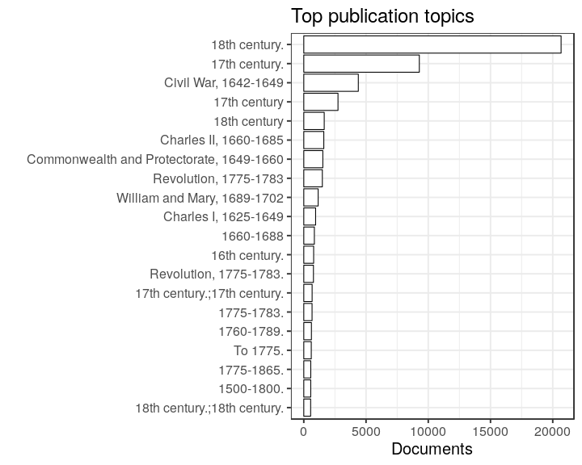

## Subject topics

  * 6986 [unique accepted subject topics](output.tables/subject_topic_accepted.csv)
  * [List of discarded subject topics](output.tables/subject_topic_discarded.csv)
  * 19582 documents (43%) are assigned a subject topic 

Top-20 subject topics and number of documents for each.

### Publication topic

We also have the publication_topic field.

  * 3876 [unique accepted publication topics](output.tables/publication_topic_accepted.csv)
  * [List of discarded publication topics](output.tables/publication_topic_discarded.csv)
  * 38035 documents (83%) are assigned a publication topic 

Top-20 publication topics and number of documents for each.

